# Goto 2018

Table of Contents
=================

   * [Goto 2018](#goto-2018)
      * [Key Learnings](#key-learnings)
      * [Troubleshooting &amp; Debugging Microservices in Kubernetes](#troubleshooting--debugging-microservices-in-kubernetes)
      * [Serverless Architectural Patterns and Best Practices](#serverless-architectural-patterns-and-best-practices)
      * [Augmented Reality - Flavours, Challenges and Writing AR Experiences in JavaScript](#augmented-reality---flavours-challenges-and-writing-ar-experiences-in-javascript)
      * [Your Superpower User Manual](#your-superpower-user-manual)
      * [How Software can be Thought of as a Force for Good](#how-software-can-be-thought-of-as-a-force-for-good)
      * [Energy and Education Access for Remote Communities](#energy-and-education-access-for-remote-communities)
      * [Experience Report - Teaching Kids to Code for 10 Years](#experience-report---teaching-kids-to-code-for-10-years)
      * [Insecure Transit - Microservice](#insecure-transit---microservice)
         * [metdata](#metdata)
         * [content](#content)
      * [Swearing, Nudity and Other Vulnerable Positions](#swearing-nudity-and-other-vulnerable-positions)
         * [metadata](#metadata)
         * [cotent](#cotent)
      * [Optimizing Kubernetes deployments with Helm](#optimizing-kubernetes-deployments-with-helm)
         * [metadata](#metadata-1)
         * [content](#content-1)
            * [examples](#examples)
      * [Artificial Intelligence Reloaded - AI Applications in the Industry](#artificial-intelligence-reloaded---ai-applications-in-the-industry)
         * [metadata](#metadata-2)
         * [content](#content-2)
      * [Event-based Architecture and Implementations with Kafka and Atom](#event-based-architecture-and-implementations-with-kafka-and-atom)
         * [metadata](#metadata-3)
         * [content](#content-3)
      * [The Simpsons and Their Mathematical Secrets](#the-simpsons-and-their-mathematical-secrets)
      * [Frugal Innovation](#frugal-innovation)
         * [metadata](#metadata-4)
         * [content](#content-4)
      * [The 7 quests of resilient software design](#the-7-quests-of-resilient-software-design)
         * [metadata](#metadata-5)
         * [content](#content-5)
      * [Accelerated Learning: How Agile Can Help You?](#accelerated-learning-how-agile-can-help-you)
         * [metadata](#metadata-6)
         * [content](#content-6)
      * [The World after Microservice Migration with Service Mesh and Contract Testing](#the-world-after-microservice-migration-with-service-mesh-and-contract-testing)
         * [metadata](#metadata-7)
         * [content](#content-7)
      * [The Leprechauns of Software Engineering](#the-leprechauns-of-software-engineering)
         * [metadata](#metadata-8)
         * [content](#content-8)
      * [GraalVM: Run Programs Faster Anywhere](#graalvm-run-programs-faster-anywhere)
         * [metadata](#metadata-9)
         * [content](#content-9)

Created by [gh-md-toc](https://github.com/ekalinin/github-markdown-toc)

## Key Learnings

* [Key Learnings](key_learnings.md)

## Troubleshooting & Debugging Microservices in Kubernetes

* https://gotober.com/2018/sessions/682
* https://saturnism.me/talk/troubleshooting-debugging-microservices/
* https://github.com/saturnism/spring-boot-docker/tree/master/examples-java
* @saturnism @hostirosti

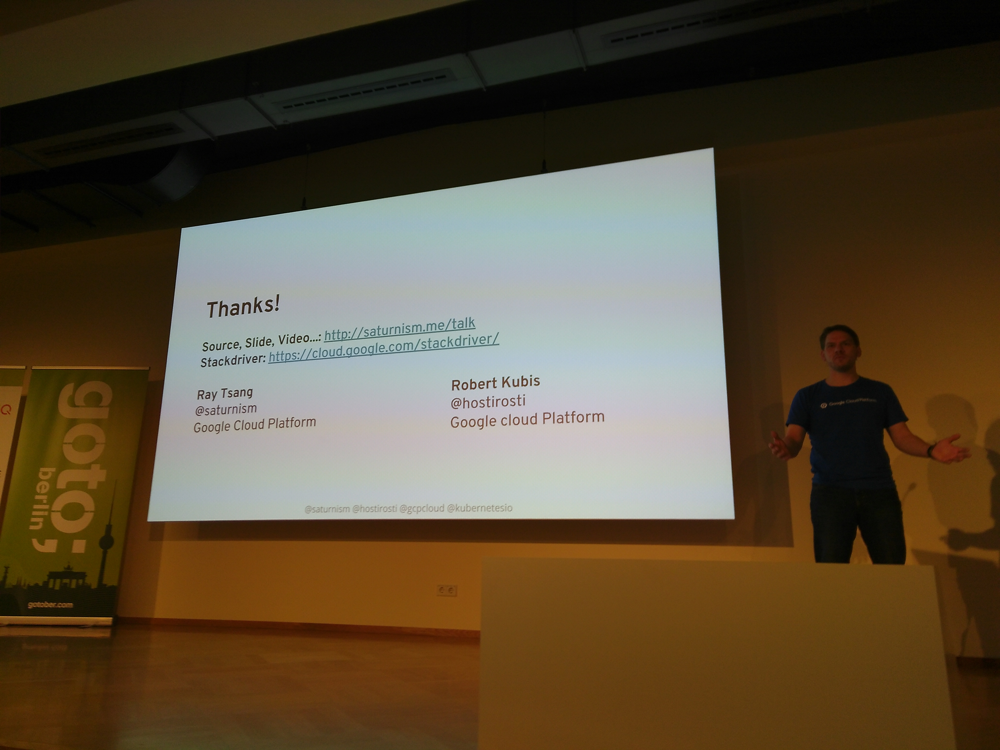

https://cloud.google.com/stackdriver

Namespace ~ Environment

    kubectl get ns
    kubectl get pods -n abcd

Alles gleich - Unterschiede, zb DB secrets: in config map

Logs durchsuchen: BigQuery

    kubectl proxy
    kubectl exec ...
    kubectl port-forward ...

weave-scope

    * [Stackdriver Trace](https://cloud.google.com/trace/)
    * [Stackdriver Debugger](https://cloud.google.com/debugger/)

Debugger: snapshot

Tracing: open senses, zipkin

## Serverless Architectural Patterns and Best Practices

* https://gotober.com/2018/sessions/499
* https://files.gotocon.com/uploads/slides/conference_12/499/original/gotober_serverless_microservices.pdf
* @sascha242

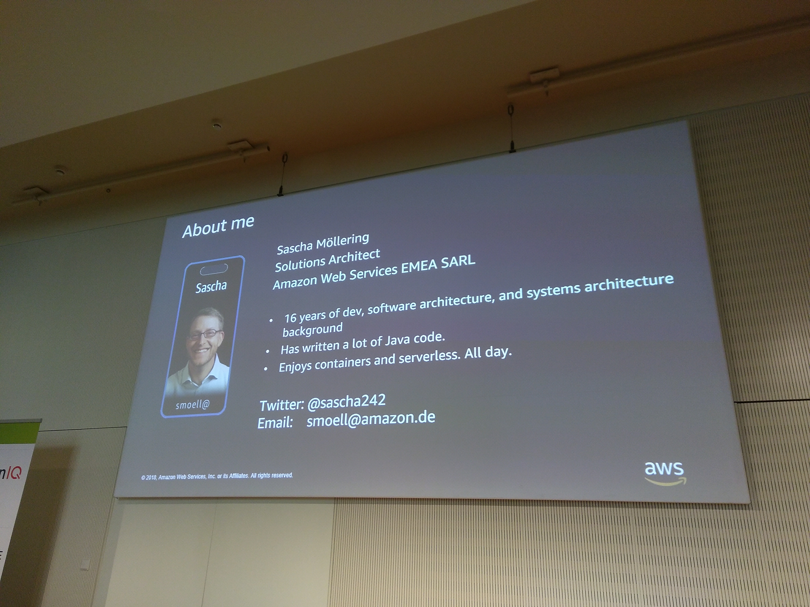

* Avoid host afinity
* Consul, eureka, zookeeper
* SAM
* don't dos from the talk:
    * Struktur unklar, keine klare Abgrenzung der Themen
    * Top-Level view fehlt, viele vollkommen willkürlich wirkende Details ...
    * Warum das ganze? Welche >Anwendungsfall<? Wozu hilft das?
    * Begriffe nicht erklärt
    * Wozu sind die Produkte da?
    * Werbeveranstaltung
    * Total überfrachtet
    => einfache Diagramme
    * Langweilig, >keine Demos<
    * Zu viel Text, zu wenig Diagramme

* AWS
    * Komplexe, eigene Welt
    * Will man sich das antun?
    * Spart einem das Arbeit?
    * Vendor lock

## Augmented Reality - Flavours, Challenges and Writing AR Experiences in JavaScript

* https://gotober.com/2018/sessions/494
* https://files.gotocon.com/uploads/slides/conference_12/494/original/Goto_AR_wikitude.pdf

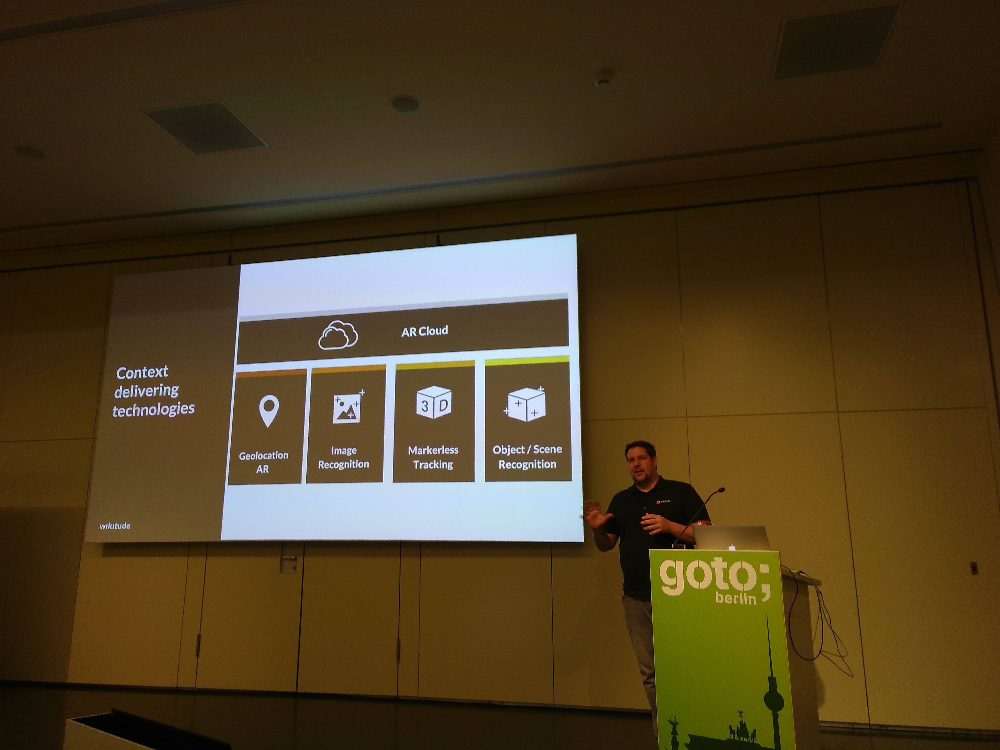

* AR Cloud / wikitude
* WebRTC
* Markerless AR
* AR Cloud is a localization service that works indoor and outdoor globally based on visual information with high precision and allows to share AR experiences with other users in real-time across any AR device 
* [wikitude_ar_cloud.pdf](images/wikitude_ar_cloud.pdf)
* https://cdn.wikitude.com/videos/Wikitude_AR-Cloud_v050418_low-res.mp4

## Your Superpower User Manual

* https://gotober.com/2018/sessions/551
* https://files.gotocon.com/uploads/slides/conference_12/551/original/Your%20Superpower%20User's%20Manual.pdf
* @marcacohen

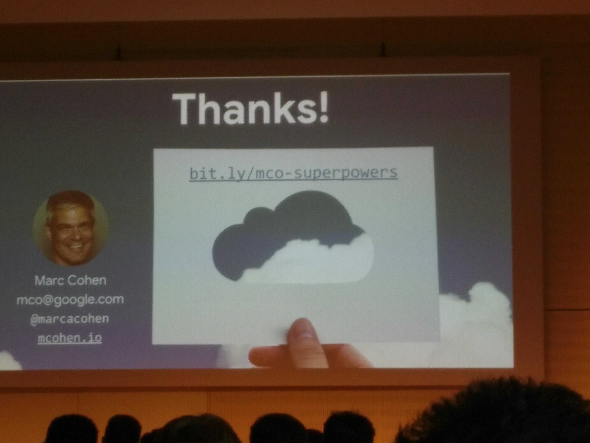

* Google Cloud Cheat Sheet
* Google Cloud Big Query
* Internet archive 
    * https://httparchive.org/
    * https://github.com/HTTPArchive/httparchive.org/blob/master/docs/gettingstarted_bigquery.md
    * https://console.cloud.google.com/bigquery?p=httparchive
* GH archive
    * https://www.gharchive.org/
    * https://www.gharchive.org/#bigquery
    * https://bigquery.cloud.google.com/table/githubarchive:day.20150101
* [Auto ML](https://cloud.google.com/automl/) Modelle generieren
* https://www.tensorflow.org/
* [word2vec](https://code.google.com/archive/p/word2vec/)
    * https://en.wikipedia.org/wiki/Word2vec
    * 
* Doc2vec
    * https://medium.com/@klintcho/doc2vec-tutorial-using-gensim-ab3ac03d3a1
    * http://rare-technologies.com/doc2vec-tutorial/
* Cloud Scheduler
* Jupyter bei Google:
    * [Google Colaboratory](https://colab.research.google.com/notebooks/welcome.ipynb)
    * Tensor Flow & Github integration
* [Google reserve image search](https://images.google.com/)


## How Software can be Thought of as a Force for Good
* https://gotober.com/2018/sessions/654
* https://twitter.com/makkina
* Why does the company exist?
* Sustainability rating
* Design thinking
* Book: reinventing Organisation

## Energy and Education Access for Remote Communities
* https://gotober.com/2018/sessions/539
* https://www.weforum.org/agenda/authors/jaideep-bansal/
* Expiditionen: http://ghe.co.in/
* https://www.youtube.com/watch?v=AwS42muvKQ0&index=3&list=PLEx5khR4g7PJquVHXtkcdo-QzK54bfmY9

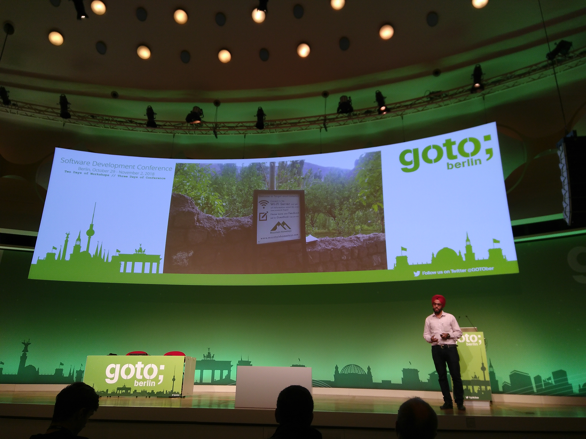

* BBC Breakthrough
* BBC Power to Himalaya
* Inter & Intravillage Communication

## Experience Report - Teaching Kids to Code for 10 Years

* https://gotober.com/2018/sessions/503
* https://files.gotocon.com/uploads/slides/conference_12/503/original/FINAL-10yrs-TKP.pdf
* TKPJava
* TeachingKidsProgrammning.com

## Insecure Transit - Microservice
### metdata
* https://gotober.com/2018/sessions/523
* Video
* @samnewman
* https://samnewman.io
* slides: https://www.dropbox.com/s/fl8mojfoi1fzjg3/InsecureTransit.pdf?dl=0
* https://samnewman.io/offerings/videos/
* https://www.youtube.com/watch?v=1sjqHlLuRw8&list=PLEx5khR4g7PIEfXSB9bDS4lB-J9stOynD&index=2

### content
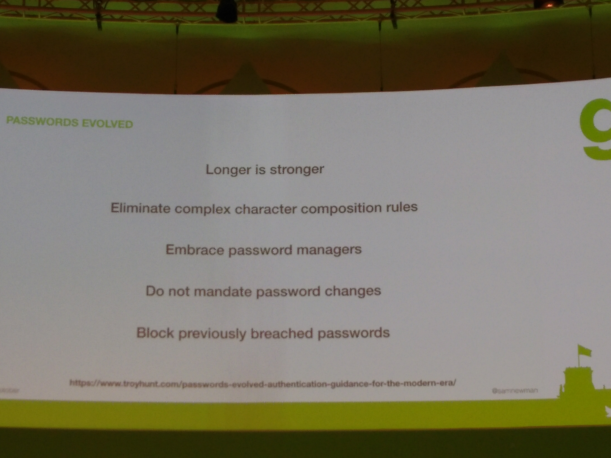

* Sam Newman - Building Microservices
* [Equifax Breach](https://www.moneysavingexpert.com/news/protect/2017/09/massive-equifax-data-breach---what-you-need-to-know)
* [Data Breach Investigation Report 2017](http://www.verizonenterprise.com/resources/reports/rp_DBIR_2017_Report_en_xg.pdf)
* Single worst problem: Weak or stolen passwords
    * [HOW DO  BREACHES  OCCUR?](http://www.verizonenterprise.com/verizon-insights-lab/dbir/2017/)
    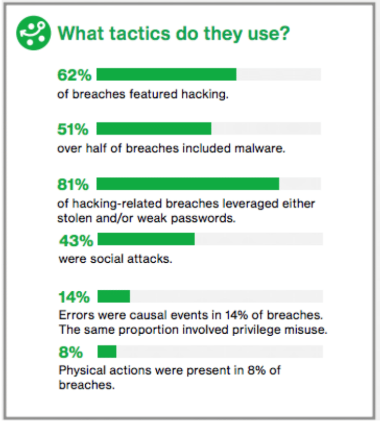
* Pheonix Infrastructure Pattern
* Single provider for everything: gefährlich!
    * z.B. AWS: https://www.theregister.co.uk/2014/06/18/code_spaces_destroyed/
* Rotate secret
* Consul-vault
* “44  percent  of  security  breaches  occur  after  vulnerabilities  and  solutions  have  been  identified.  In  other  words,  the  problems  could  have  been  avoided  if  found  vulnerabilities  had  been  addressed  sooner.”
* CVE Database
* Kubernetes &  IAAS: patchen wird einem abgenommen!
* Check container: https://github.com/coreos/clair
* Find outdated dependencies: https://snyk.io/
* https://www.aquasec.com/
* Https everywhere
* Let's encrypt CA
* Mutual TLS Certificate
    * Azure
* Confused Deputy Problem
* JWT token -> only internal
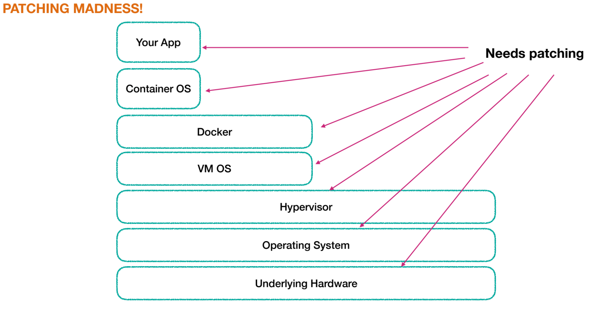
* Service Mesh: Istio
* Recap:
    * Patching & Passwords
    * Storing secrets   
    * Transportation security
    * Authorization
    * Service Meshes

## Swearing, Nudity and Other Vulnerable Positions
### metadata
* John Le Drew
* https://gotober.com/2018/sessions/497
* https://www.wisenoodles.com/talks/swearing-nudity-and-other-vulnerable-positions
* https://twitter.com/antz29
* https://www.wisenoodles.com/
* https://www.youtube.com/watch?v=ofBv-num0lA&index=4&list=PLEx5khR4g7PJquVHXtkcdo-QzK54bfmY9

### cotent

[Google Aristotle](https://rework.withgoogle.com/blog/five-keys-to-a-successful-google-team/)
- psychological safety - feel safe to take risks and be vulnerable
- dependability - get things done with quality
- Structure & Clarity - clear roles, plans, Goals
- Meaning - work is personally important
- Impact - people think works matters, feel small wins

1. Psychological safety: Can we take risks on this team without feeling insecure or embarrassed?
1. Dependability: Can we count on each other to do high quality work on time?
1. Structure & clarity: Are goals, roles, and execution plans on our team clear?
1. Meaning of work: Are we working on something that is personally important for each of us?
1. Impact of work: Do we fundamentally believe that the work we’re doing matters?

-> checklists

Psychological safety: belief that one will not be punished or humiliated for speaking up with ideas, questions, concern or mistakes

* or: "You're safe, when you can speak your truth, raise your concerns and give and receive constructive feedback without the fear of humiliation, rejection or punishment"

* Mindfulness
    * Paying attention is about noticing how you feeld, how people around you are feeling and approaching people and the organisation with curiosity and not judgement.

improv

wisenoodles.com

-> "yes, and" instead of "yes, but"
    -> go with the idea, improvise, leave room for creativity


* Unsafety -> stress -> inpact on social life

Are you OK? -> replace judgent with curiosity


## Optimizing Kubernetes deployments with Helm
### metadata
* https://gotober.com/2018/sessions/662
* [>slides<](https://files.gotocon.com/uploads/slides/conference_12/662/original/Erwin%20de%20Gier%20Kubernetes%20Helm.pdf)
* https://twitter.com/erwinde
* https://github.com/erwindeg
* https://www.youtube.com/watch?v=TXZBuBQpm-Q

### content
* https://www.helm.sh/
* Package Managements for Kubernetes
* Tiller deamon wird in Cluster installiert
    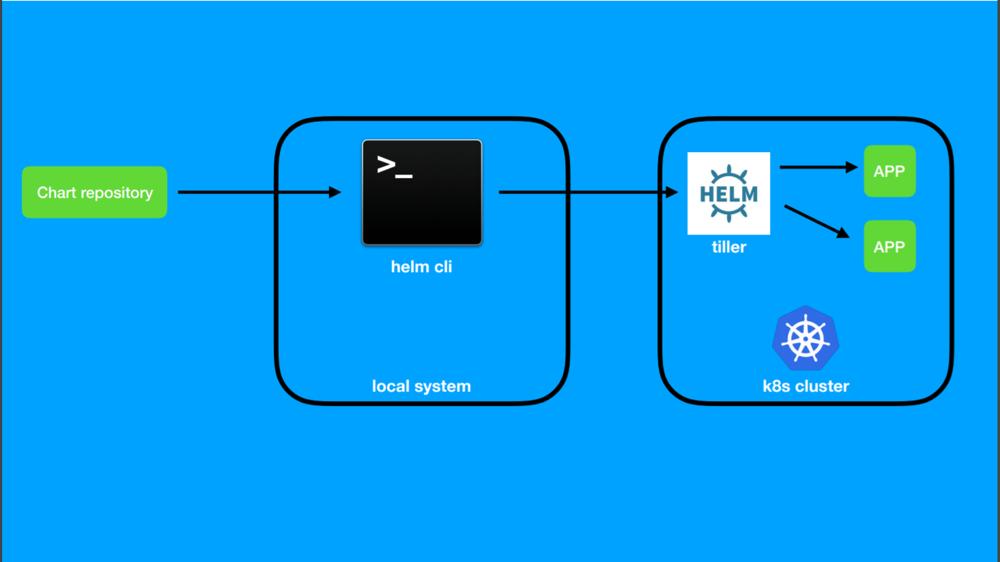
* ```{{ .Values.key.name }}``` - Syntax
* examples: https://github.com/erwindeg/k8s-helm/tree/master/helm_chart_guestbook/templates
* ?how to prevent accidental deployments to prod?
* Helm hat kubenetes setups für alles mögliche :-) (chart repositories) -> für Workshop nutzen?
    * jenkins, sonar, postgres, rabbit mq etc.
    * https://github.com/helm/charts
    * https://github.com/helm/charts/tree/master/stable
* Dependencies
    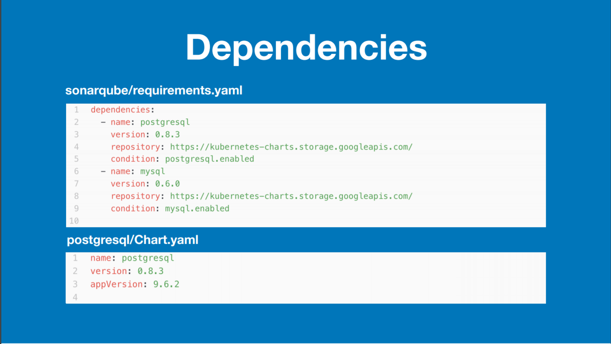
* https://docs.helm.sh/using_helm/#quickstart-guide

#### examples 

    helm install stable/sonarqube --namespace sonarqube --set service.externalPort=9001
    helm update ...
    helm history ...
    helm rollback ...
    -f "values.prod.yml"
    --set ...=....
    --set-file
    --dry-run --debug
    helm create --starter
    helm test

## Artificial Intelligence Reloaded - AI Applications in the Industry

### metadata
* Christoph Windheuser
* https://gotober.com/2018/sessions/544
* https://twitter.com/intellification
* > slides missing
* http://intellification.net/

### content
* Big data is foundation of AI
* word2Vec
* LSTM
* DVC

## Event-based Architecture and Implementations with Kafka and Atom
### metadata
* Eberhard Wolff
* [>slides<](https://www.dropbox.com/sh/obl7ep3vhdnnqy4/AAD7TTjA2v0Fo2cZ-GeBS2awa?dl=0&preview=MicroservicesEventsWithKafkaAndAtom.pdf)
* https://gotober.com/2018/sessions/535
* https://github.com/ewolff

### content

* http://microservices-buch.de/ueberblick.html
* http://microservices-praxisbuch.de/rezepte.html
* Microservices  =  Extremely  decoupled  modules
* Most  important  factor  for  microservice:Getting  the  split  right!!!
* ...communicate  via  business  events
* https://github.com/ewolff/microservice-kafka
* Atom feed
    * https://github.com/ewolff/microservice-atom
    * https://validator.w3.org/feed/docs/atom.html
    * http caching
        * GET with If-modified-Since header
        * server returns 304 (not modified) ... or new data
* REST can be asynchronuous


## The Simpsons and Their Mathematical Secrets
* Simon Singh
* https://gotober.com/2018/sessions/504
* http://simonsingh.net/
* https://twitter.com/SLSingh

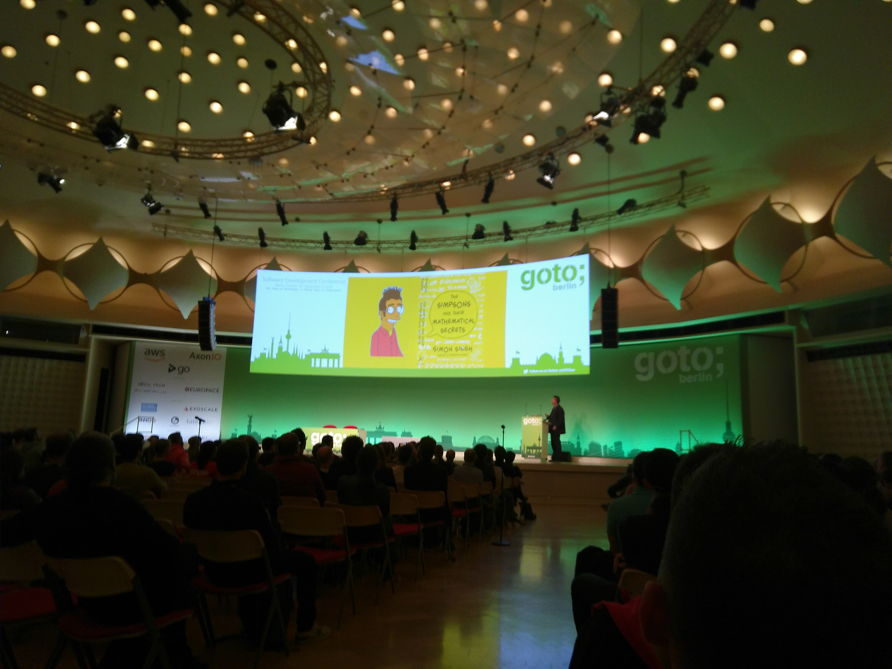

## Frugal Innovation
### metadata
* Betty Enyonam Kumahor
* https://gotober.com/2018/sessions/561
* [>slides<](https://files.gotocon.com/uploads/slides/conference_12/561/original/GOTOBER_presentation_asof_1440.pdf)
* https://twitter.com/enyok

### content
* Frugal innovation: Book Jugaad Innovation
* Constrainted Contexts
* Design Thinking

## The 7 quests of resilient software design
### metadata
* Uwe Friedrichsen
* https://gotober.com/2018/sessions/676
* [>slides<](https://files.gotocon.com/uploads/slides/conference_12/676/original/uwe_friedrichsen-the_seven_quests_of_rsd.pdf)
* @ufried


### content

* Understand busines case
* Resilience is not about making money - Resilience is about not losing money
* Use business monitoring
    - all business decisions are made in the gut
    - pretend to adress the brain, but aim for the gut
    - "Its strange for developers, but it's the way managers work"
* Deal with unavailability
    * Think about when a problem occurs
* Failures:
    * Crash failure
    * Omission failure
    * Timing failure
    * Response failure
    * Byzantine failure
    * distributed Systems
        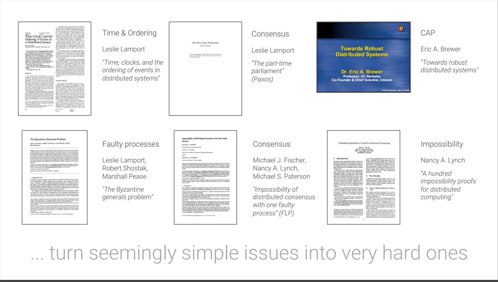
* non-determinism
    * we usually use deterministic thinking to reason about distributed systems
    * Distributed systems introduce non-determinism regarding
        * Execution completeness
        * Message ordering
        * Communication timing
    * You will be affected by this at the application level
        * Don’t expect your infrastructure to hide all effects from you
        * Better have a plan to detect and recover from inconsistencie
* Availability goes down with the number of services involved in a request
    * Assume a service availability of 99,5% (incl. planned downtimes)
        * 10 services involved in a request à 95,1% probability of success
        * 50 services involved in a request à 77,8% probability of success
* Establish the ops-dev feedback loop
* Site Reliability Engineering (STE)
* Everything we learned about reuse is good inside boundaries, but outside these it makes systems instable
    * => get the functional design right
* Be (extremely) wary of reusability
    * Reusability increases coupling
    * Reusability usually leads to bad service design
    * Reusability compromises availability
    * Reusability rarely pays
    * Do not strive for reusable services
    * Strive for replaceable services instead
    * Try to tackle reusability issues with libraries
* Mitigate
* Using resilience patterns
    * Patterns are options, not obligations
    * Don’t pick too many patterns
    * Each pattern increases complexity
    * Complexity is the enemy of robustness
    * Each pattern costs money in dev & ops
    * You only have a limited resilience budget
    * Look for complementary patterns
* caching won't always help
    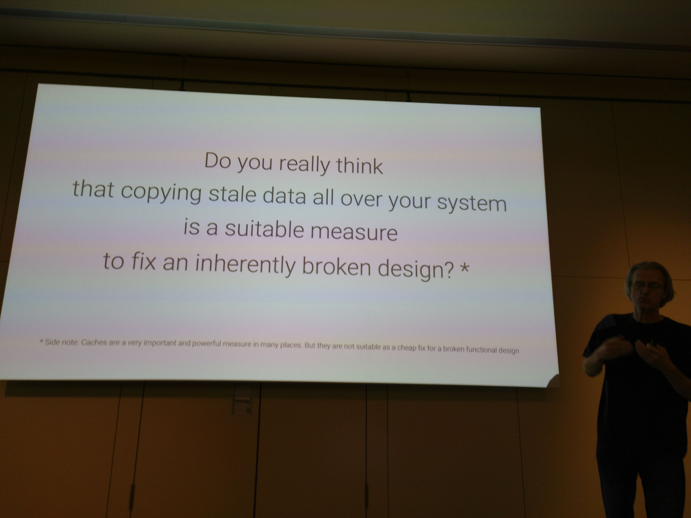
* Preserve the collective memory / Use wisdom from earlier

## Accelerated Learning: How Agile Can Help You?
### metadata
* Artur Margonari
* https://gotober.com/2018/sessions/498
* [>slides<](https://gotober.com/12/sessions/498/slides)
* https://twitter.com/arturmargonari

### content
* comfort zone
    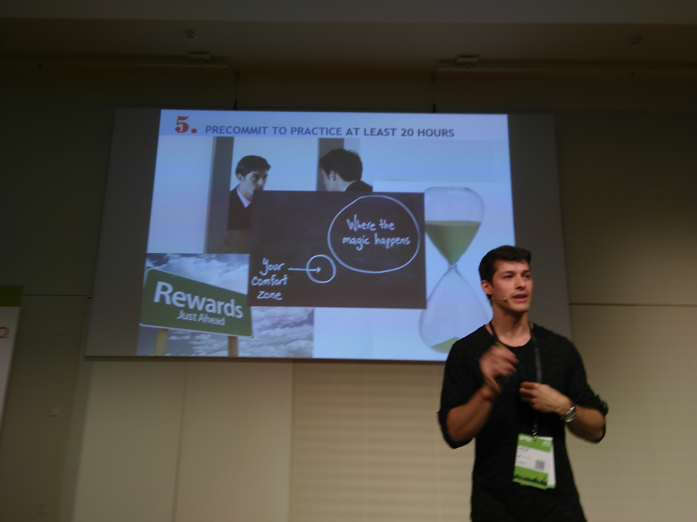


1. DECIDE WHAT YOU WANT
2. DECONSTRUCT THE SKILL
3. RESEARCH THE SKILL JUST ENOUGH
4. REMOVE BARRIERS
5. PRECOMMIT TO PRACTICE AT LEAST 20 HOURS

* Reading / watching recos:
    * Expert in a year
    * First year guitar progress jack woodman
    * Therese trollbu
    * The Dan Plan
    * The tim ferris experiment
    * Andrew Tarvin - Humor at Work <-
    * How to learn anything in half time jim kwik
* learning tips:
    * Find menote
    * Book
    * Youtube
    * Record yourself
    * Get rewards

## The World after Microservice Migration with Service Mesh and Contract Testing
### metadata
* Dejan Mitrovic
* https://gotober.com/2018/sessions/674
* [>slides<](https://files.gotocon.com/uploads/slides/conference_12/674/original/GOTO%20Berlin%202018.pdf)
### content
* service mesh
    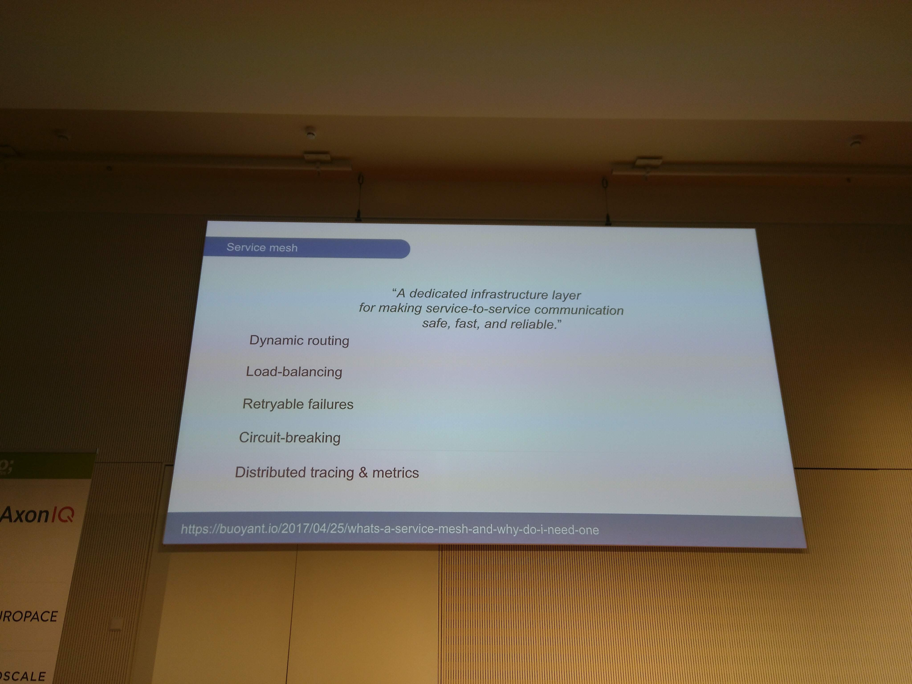
    * https://buoyant.io/2017/04/25/whats-a-service-mesh-and-why-do-i-need-one
    * https://istio.io/
    * https://konghq.com/solutions/service-mesh/
    * https://learn.hashicorp.com/consul/getting-started/connect.html
* Servicemash: linkerd version 1
* registrator gliderlabs => put docker container infos into consul
* Pact broker
* Pact can check swagger api
    * swagger-pact-validator
* Regression Testing: http://wiremock.org/docs/record-playback/
* Idea: Generate Tests from swagger API

## The Leprechauns of Software Engineering
### metadata
* Laurent Bossavit
* https://gotober.com/2018/sessions/565
* @morendil
    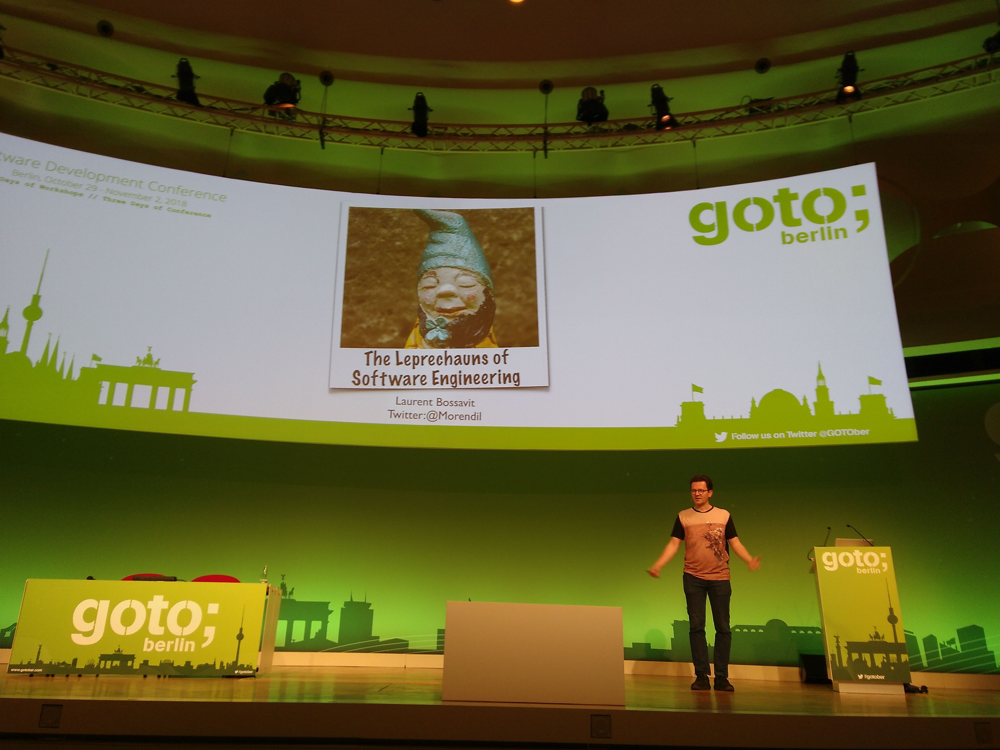

### content
* Self Defence Techniques
* fact-check
    * research
    * ask
    * measure
* dress as scientist
    * look up sources
* sci-hub
    * Scientific knowledge should be free
    * https://de.wikipedia.org/wiki/Sci-Hub
    * http://sci-hub.tech/
* large amounts of money
    * check data
* Barry Boehm
* Curiosity - desire to know the truth
* "Lack of a sense of history"
* Book: https://leanpub.com/leprechauns

## GraalVM: Run Programs Faster Anywhere
### metadata
* Oleg Šelajev
* https://gotober.com/2018/sessions/650
* [>slides<](https://files.gotocon.com/uploads/slides/conference_12/650/original/shelajev-graalvm-gotober.pdf)
* @shelajev

### content

* Graal Archtitecture
    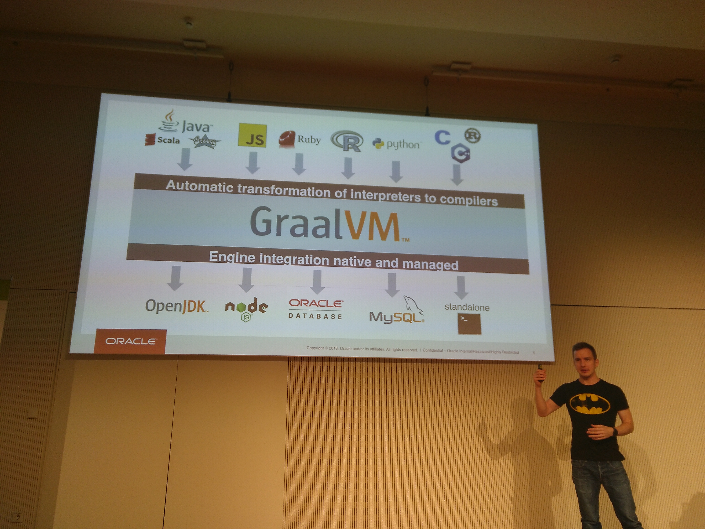
* medium.com/graalvm/graalvm-ten-things-12d9111f307d
    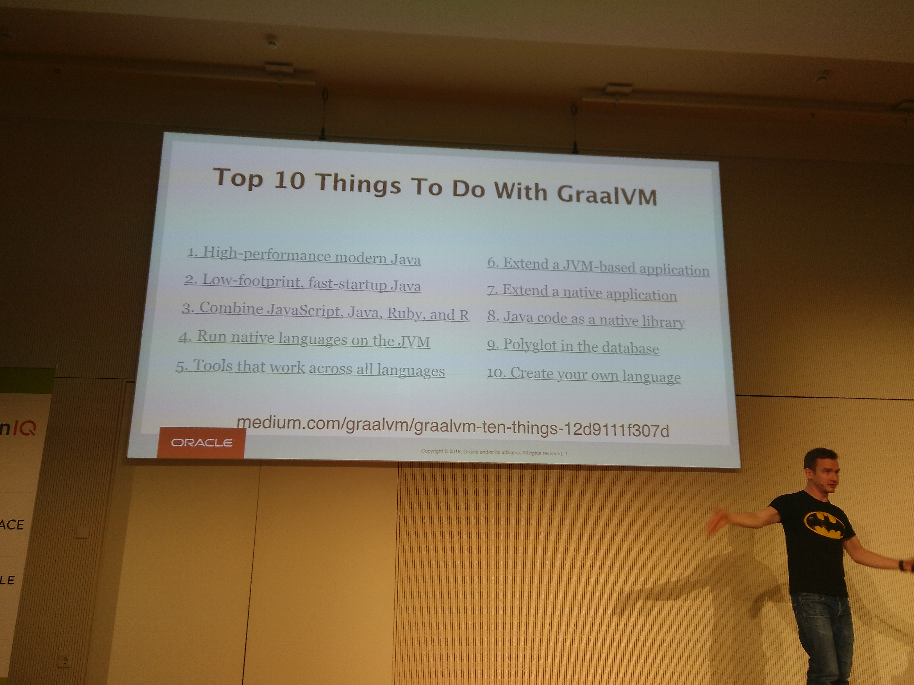
* https://medium.com/graalvm/compiling-scala-faster-with-graalvm-86c5c0857fa3
* possible use cases:
    * compute & compile faster
    * combine different languages
    * Execute without VM
    * decrease executable size & startup times

