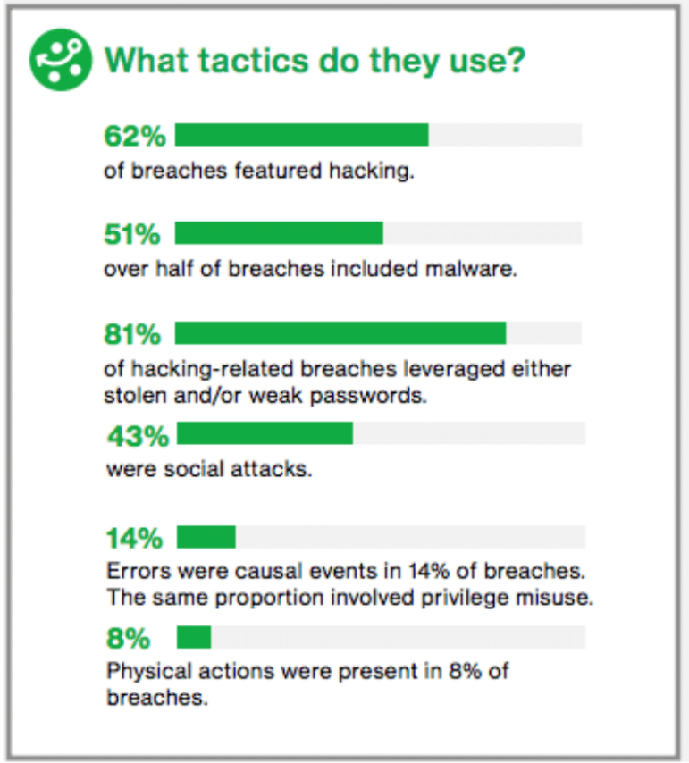

* Generell
    * YoutTube Channel
        * https://www.youtube.com/channel/UCs_tLP3AiwYKwdUHpltJPuA
        * Z.B: Martin Fowler Talks:
            * https://www.youtube.com/results?search_query=fowler+goto
            * https://www.youtube.com/watch?v=4E3xfR6IBII
    * Goto Play App (Videos abspielen)
        * [Android](https://play.google.com/store/apps/details?id=com.gotoplay)
        * [IOS](https://itunes.apple.com/us/app/goto-play/id1216616835)
        * > Video proposals!
    * > Google Big Query Demo (http archives?)
    * > Service Mesh
        https://blog.buoyant.io/2017/04/25/whats-a-service-mesh-and-why-do-i-need-one/
* Troubleshooting & Debugging Microservices in Kubernetes
    * Logs durchsuchen: BigQuery
    * `kubectl exec ...`
    * `kubectl port-forward ...`
    * [Stackdriver Trace](https://cloud.google.com/trace/)
    * [Stackdriver Debugger](https://cloud.google.com/debugger/)
    * => Alles nochmal ausprobieren (im Rahmen von MS-MS?)
* Augmented Reality - Flavours, Challenges and Writing AR Experiences in JavaScript
    * AR Cloud / wikitude
* Your Superpower User Manual
    * Internet archive 
        * https://httparchive.org/
        * https://github.com/HTTPArchive/httparchive.org/blob/master/docs/gettingstarted_bigquery.md
        * https://console.cloud.google.com/bigquery?p=httparchive
    * GH archive
        * https://www.gharchive.org/
        * https://www.gharchive.org/#bigquery
        * https://bigquery.cloud.google.com/table/githubarchive:day.20150101
    * Jupyter bei Google:
        * [Google Colaboratory](https://colab.research.google.com/notebooks/welcome.ipynb)
        * Tensor Flow & Github integration
* How Software can be Thought of as a Force for Good
    * https://gotober.com/2018/sessions/654
    * https://twitter.com/makkina
    * https://bcalmbcorp.com/
    * Why does the company exist?
    * Sustainability rating
* Energy and Education Access for Remote Communities
    * https://gotober.com/2018/sessions/539
    * https://www.weforum.org/agenda/authors/jaideep-bansal/
    * Expiditionen: http://ghe.co.in/
    * https://www.youtube.com/watch?v=AwS42muvKQ0&index=3&list=PLEx5khR4g7PJquVHXtkcdo-QzK54bfmY9
* Insecure Transit - Microservice
    * Single worst problem: Weak or stolen passwords
    * [HOW DO  BREACHES  OCCUR?](http://www.verizonenterprise.com/verizon-insights-lab/dbir/2017/)
        
    * “44  percent  of  security  breaches  occur  after  vulnerabilities  and  solutions  have  been  identified.  In  other  words,  the  problems  could  have  been  avoided  if  found  vulnerabilities  had  been  addressed  sooner.”
    * Patching Madness:
        
        * Kubernetes &  IAAS: patchen wird einem abgenommen!
        * Check container: https://github.com/coreos/clair
        * Find outdated dependencies: https://snyk.io/
    * https://www.youtube.com/watch?v=1sjqHlLuRw8&list=PLEx5khR4g7PIEfXSB9bDS4lB-J9stOynD&index=2
* Swearing, Nudity and Other Vulnerable Positions
    * Psychological safety: belief that one will not be punished or humiliated for speaking up with ideas, questions, concern or mistakes
    * "Psychological safety was far and away the most important of the five dynamics we found"
        * ask for help without judgement on competence
        * ask for goal without sounding like the only one out of loop
        * raise red flag without being judged
    * How to achieve that?
        * Mindfulness
            * Paying attention is about noticing how you feeld, how people around you are feeling and approaching people and the organisation with curiosity and not judgement.
        * Yes, and ...  instead of "yes, but"
            * -> go with the idea, improvise, leave room for creativity
        * Are you OK? -> replace judgent with curiosity
    * Links:
        * https://www.nytimes.com/2016/02/28/magazine/what-google-learned-from-its-quest-to-build-the-perfect-team.html
        * https://rework.withgoogle.com/blog/five-keys-to-a-successful-google-team/
        * https://rework.withgoogle.com/guides/understanding-team-effectiveness/steps/foster-psychological-safety/
    * https://www.youtube.com/watch?v=ofBv-num0lA&index=4&list=PLEx5khR4g7PJquVHXtkcdo-QzK54bfmY9
* Event-based Architecture and Implementations with Kafka and Atom
    * Async events possible via Atom feeds
* The Leprechauns of Software Engineering
    * fact-check
        * research
        * ask
        * measure
        * look up sources
    * sci-hub
        * Scientific knowledge should be free
        * https://de.wikipedia.org/wiki/Sci-Hub
        * http://sci-hub.tech/
