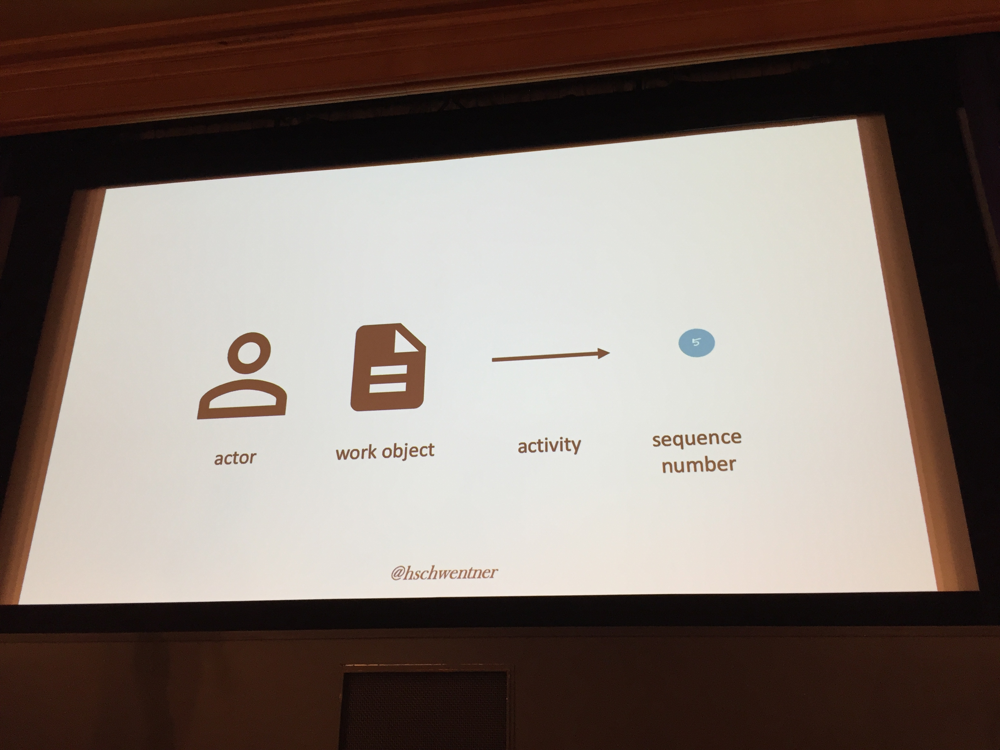

# BedCon Berlin 2019

## Conference

* [Berlin Expert Days 2019](http://bed-con.org/2019/)

## Key Learnings

* [Key Learnings](key_learnings.md)

## Service oriented alerting

* Daniel Fuchs ( dev@synyx_ka / https://twitter.com/honnel )
* Vladimir Dobriakov ( infrastructure-as-code.de / https://twitter.com/enterprise_geek )
* Abstract: "Es ist leicht, viele herumliegende Metriken einzusammeln und damit bunte Regenbogen zu malen. Aber hat eine volllaufende Festplatte wirklich Auswirkung auf den Endkunden, so dass die Rufbereitschaft mitten in der Nacht geweckt werden muss? In diesem Vortrag werden wir einen umgekehrten Ansatz vorstellen, wie man ausgehend von fachlichen Anforderungen Ziele definiert, und diese automatisiert überprüfbar in ein bestehendes Alarmierungssystem integriert."
* 
* {UN}KOWN {UN}KNOWNS
* Sli sla slo
    * SLA or service level agreement is a contract that the service provider promises customers on service availability, performance, etc.
    * SLO or service level object is a goal that service provider wants to reach.
    * SLI or service level indicator is a measurement the service provider uses for the goal.
* Durchsatz: in Verhältnis zu Queue-Länge, expected wait
* Niemand da?
    * Erste Ableitung! (Decline: -f(x) > d)
    * Vereinfachung: jetzt vs vor 5 Minuten
* Feierabend: und jetzt?
    * Formel mit erwartetem traffic (0 oder 1)
    * wie kommt das ins System? => z.B. eigener Service
* Prometheus dupliziert (Redundanz), OpsGenie dedupliziert, Heartbeat falls einer ausfällt
* was passiert wenn OpsGenie ausfällt? => Pech ;-) Aber passiert wohl nur selten.
* Spring Boot & Micrometer
* Prometheus: scrape config, prom pullt
* Prometheus !!rate: immer pro Sekunde!!!
* ErrorRate && errorCount einbeziehen => stabiler!
* Fehlerintervall sinnvoll wählen (z.B. 5 Min)
* Description dafür nutzen hilfreiche Kontextinfos, alles was hilft das Problem zu finden und zu fixen
* Yamls in repo (bei Anwendung!!!) werden beim Deployment ausgerollt (Datei an richtige Stelle legen)
* 
* OpsGenie: Kalender, Eskalationskette
* promtool: validierung regeln, endpoints + [Unit Tests](https://prometheus.io/docs/prometheus/latest/configuration/unit_testing_rules/)
    * z.B.: `promtool config check`
* amtool: für alert manager

## Rise and Fall of Single-Page-Monoliths – Micro-Frontends und deren Integration

* Harm Norden
* Adrian Lehmann
* Abstract: "Der explorative Aufbau eines schnell wachsenden FinTechs gelang uns Backend-seitig recht gut mit Microservices. Doch Frontend-seitig konnten wir die Schaffung eines komplexen Single-Page-Monolithen nicht wirklich verhindern. Resultat: geringe Performance, lange Build-Zeiten, zyklische Abhängigkeiten, keine eindeutige Teamzuordnung, Frust…
Wir zeigen unsere neue Architektur eines zerlegten Dashboards in eigenständige Micro-Frontends mit Angular und Web Components. Eine „Software aus einem Guss“ - hinsichtlich UX und übergreifend einheitlichem Styling kein triviales Unterfangen!
Wir gehen gemeinsam durch relevante Code-Stellen, schildern die Herausforderungen und diskutieren Vor- und Nachteile unserer Lösung."
* 
* Bla bla
* Webcomponents:
    * webpack
    * custom Elements
    * shadow DOM, unabhäbgig von Styles und Scripts im restlichen dom
* ssi
* Edge side include
* Iframes
* Gemeinsames Styling: 
    * Globales CSS file mit globalen Variablen , Zugriff über var {...}
* Angular besteht aus webcomponents

## Bessere Monolithen – modulithische Applikationen mit Spring Boot

* Oliver Drotbohm ( https://twitter.com/odrotbohm )
* [Slides](https://speakerdeck.com/olivergierke/building-better-monoliths-modulithic-applications-with-spring-boot-cd16e6ec-d334-497d-b9f6-3f92d5db035a)
* Abstract "Vergleicht man verschiedene Ansätze um Bounded Contexte zu implementieren, ist eine modulare aber monolithische Applikation oft eine pragmatische Alternative zu Microservices, die viele neue Herausforderungen und Komplexität eines verteilten Systems erzeugen. Dennoch degenerieren die Modularität und Wart- bzw. Erweiterbarkeit monolithischer Applikationen über deren Lebenszyklus signifikant.
Der Vortrag identifiziert oft beobachte Phänomene in unstrukturierten Monolithen und diskutiert Ansätze zur Codeorganisation, Komponentenstruktur, dem Paketdesign, Transaktionen und der Nutzung von Events um die Interaktion zwischen Bounded Contexts zu implementieren. Wir betrachten dann unterstützende Technologien und Features von Spring Boot und dessen Ökosystem um architektonische Konzepte in modularen, monolithischen Applikationen zu implementieren um definierte Architektur über die Zeit zu erhalten und auf eine spätere Aufteilung mehrere Systeme vorzubereiten."
* https://github.com/odrotbohm/moduliths
* Fachliche Module -> java package
    * -> package scope nehmen 
* Spring boot: slice tests: alles andere slices wegmocken
    * -> nicht unbedingt schneller / hilfreich!
* SpringBootApplication in package
* @ModuleTest
* Methodenaufrufe durch Events ersetzen
* See also 
    * https://jqassistant.org/ & https://vimeo.com/170797227 query Java programm structure in Neo4j
    * https://www.hello2morrow.com/products/sonargraph/ analyse Java, C#, C++, Python programm structure ($$$)
    * https://github.com/clarkware/jdepend measure Java programm design
    * > https://www.archunit.org - test Java architecture asserstions

## Ktor - asynchrones Kotlin Web Framework

* Marcel Dohnal
* Abstract "In dieser Session sehen wir anhand einer Live Demo wie wir mit dem Kotlin Web Framework "Ktor" eine Rest-Schnittstelle bauen. Dabei lernen wir einige Key-Features von Kotlin, wie z.B. Coroutines kennen."
* 
* Kotlin 
    * History @ jetbrains blog
    * Features:
        - null safety
        - type inferrence
        - extension functions
        - Coroutines
* https://ktor.io/ / https://github.com/ktorio/ktor / https://github.com/ktorio/ktor-samples
* Ktor:
    * Für server und clients
    * Keine annotations
    * Keine Reflection / class path scanning
* Features:
    * Routing
    * StatusPages
    * ContentNegotiation / gson()
    * ... etc, siehe Feature Liste
    * Typsichere Html templates
* Example:
    * https://github.com/mdoh/ktor-highscore-example

## Formatting for the Masses
* Sebastian Zarnekow ( https://twitter.com/szarnekow )
* Abstract: "Code formatting is an opinionated beast. It always has been a matter of taste, and it always will be a matter of taste. This is the reason why professional formatting tools, such as Eclipse JDT, offer a gazillion number of options. Which is still not sufficient enough. After all, you can override them inline with tag-comments to make the formatter shut up. Can't we do better than that?
What if we could use machine learning techniques to detect the preferred code style that was used in a codebase so far? Turns out, we can. The Antlr Codebuff project (https://github.com/antlr/codebuff) offers a generic formatter for pretty much any given language. As long as a grammar file exists, existing source can be analyzed to learn about the rules that have been applied while writing the code. Those can than be used to pretty print newly written code. No configuration required. And existing sources will stay as nicely formatted as they are. In the end, the primary purpose of code formatting is not to rearrange all the keywords, but to make the source layout consistent.
In this talk, we will demonstrate the usage of the codebuff project and how it can be used to format the sources of your repo in a consistent way. We'll also show some other gems that have been revealed when toying around with the technology."
* 
* Readability
* Judge correctness quickly
* Spaces, indentation, alignement
* Xtext: DSL definition
* CodeBuff: codestyle by example, using ML

## Carving Microservices out of the Monolith with Domain Storytelling

* Henning Schwentner ( https://twitter.com/hschwentner )
* [Slides](https://speakerdeck.com/hschwentner/domain-storytelling)
* Abstract: "For a microservices architecture to be succesful it is crucial to have the right boundaries between the microservices. But where are the right boundaries? I would like to present a tool that helps us answer this question.
Domain Storytelling (www.domainstorytelling.org) means that we let our users tell us stories about their work. While listening, we record the stories using a pictographic language. The experts can immediately see if we understand their story. After very few stories, we understand the language of our users and find different areas of the domain. Each of these areas (called a subdomain) is a good candicate to become a microservice in our architecture.
In this talk I show how to find subdomains and which heuristics can help us."
* 
* Domain expert tells story
* Have the right people together
    -devs
    -domain experts
* Problem: communication over mental models is tricky
    * -> active listening by drawing what the dom exp said
        * Use different icons for actors and work objects
        * 
        * No 'if's - each case gets a different picture / domain story
        * [Example](https://speakerdeck.com/hschwentner/domain-storytelling?slide=45)
        * Stories developed around actors, actor-centric
        * [Workobject -> entity, Activities -> methods](https://speakerdeck.com/hschwentner/domain-storytelling?slide=76)
* "The one big model"
    * 
    * [Too big to be understood as a whole](https://speakerdeck.com/hschwentner/domain-storytelling?slide=102)
    * [Different models for different purposes](https://speakerdeck.com/hschwentner/domain-storytelling?slide=108)
    * Modulize with models
* Tools: whiteboard, https://github.com/WPS/domain-story-modeler
* https://domainstorytelling.org/

## Testcontainers - Integrationstesten mit Docker leicht gemacht

* Stefan Hildebrandt ( https://twitter.com/hildebrandttk )
* [Slides](https://consulting.hildebrandt.tk/vortraege/testcontainers/slides/index.html#/)
* Abstract: "Testcontainers ist der Kleber der Integrationstests mit benötigter Infrastruktur in Docker-Containern verbindet. Seit der Verfügbarkeit von Docker ist es leicht geworden unterschiedliche Datenbanken, Message Broker, Application Server, etc. bereitzustellen. Die Registry erleichtert die Distribution. Notwendige Konfigurationen wurden in docker-compose oder dem Build-Tool erledigt. Jetzt musste vor der Ausführung eines Tests nur noch kurz der oder die Container gestartet werden. Leider ein weitere Schritt, der bedacht, bzw. ins Vorgehen eingebaut werden musste. Fast noch wichtiger als das Starten, ist das Aufräumen, ansonsten müllt der Entwicklungsrechner oder CI-Server schnell voll! Hier setzt Testcontainers an, indem der Container-Lifecycle direkt aus dem Test gesteuert wird. So kann nichts vergessen werden, die Grenzen sind hart abgesteckt und ans Aufräumen wurde auch gedacht. Es gibt Adapter für alle gängigen Testframeworks. Falls mal etwas fehlen sollte, ist es relativ schnell geschrieben, da ein Container in zwei Zeilen Code erstellt und gestartet werden kann. Unsere Reise wird mit einem einfachen JDBC basierten Test beginnen, an dem auch die wichtigsten Komponenten erklärt werden, um dann Integrationsszenarien zum Beispiel mit SpringBoot vorzustellen."
* 
* Docker-java-binding
    * Dependencies
    * Logging
    * Spock-Unterstützung
* junit5:
    * @Testcontainers
    * @Container
* Start pro test vs pro Klasse
* Ryuk sidecar container räumt auf!
* withFileFromPath withDockerfileFromBuilder
* withExposedService proxy container sidecar
* warten bis container up ist (waitingStrategy)
* Docker-compose geht auch
* Selenium
* Commit-after-failure (?)