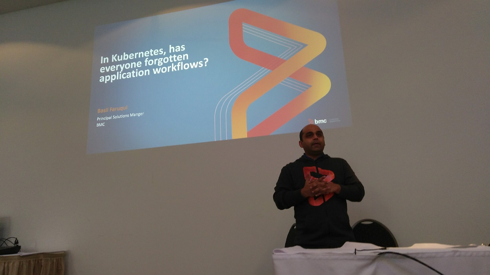
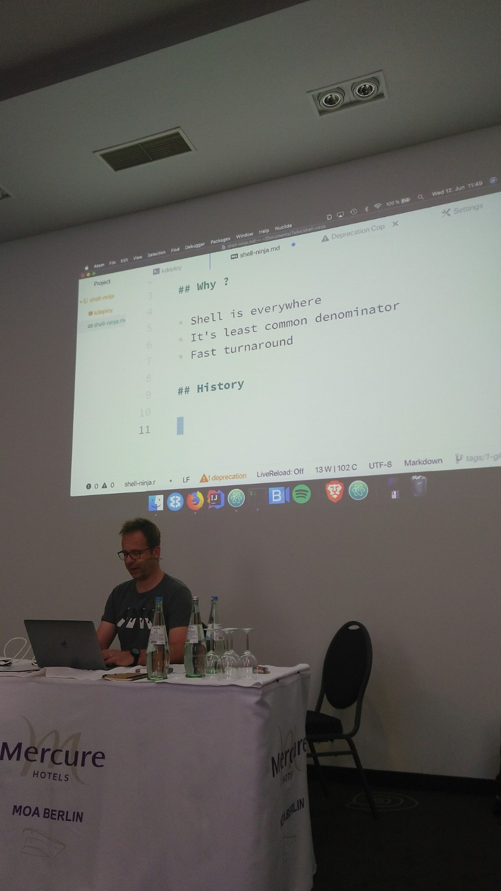
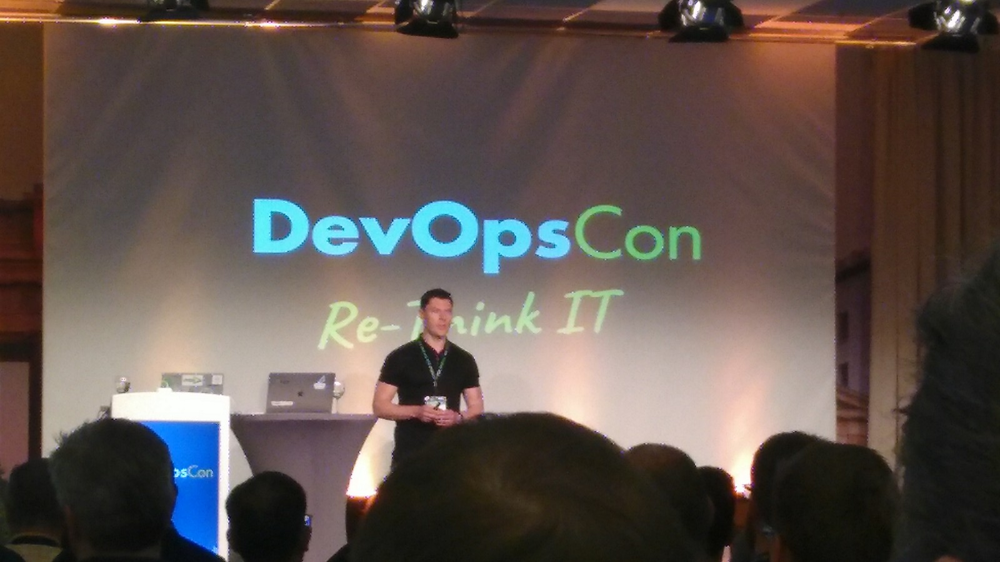
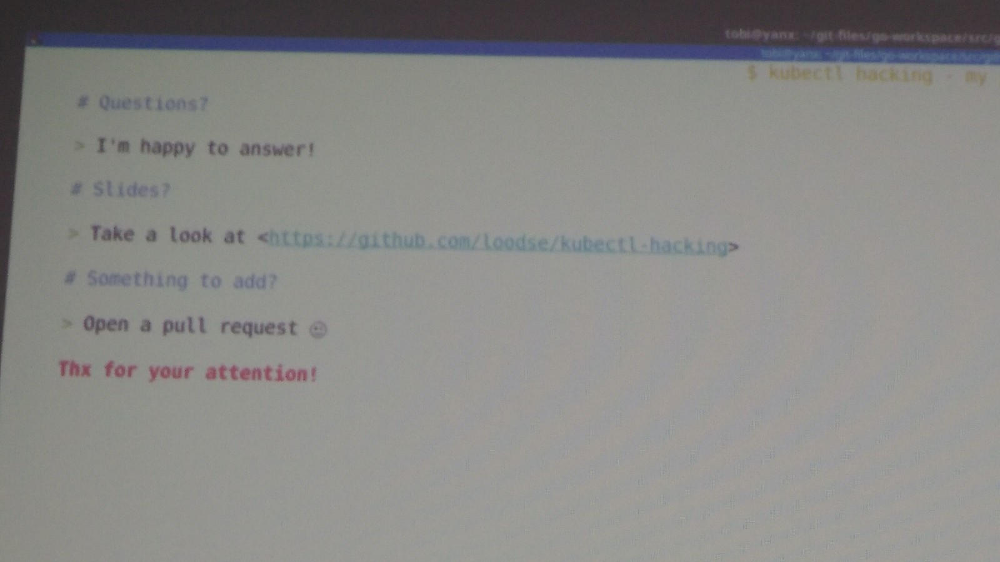
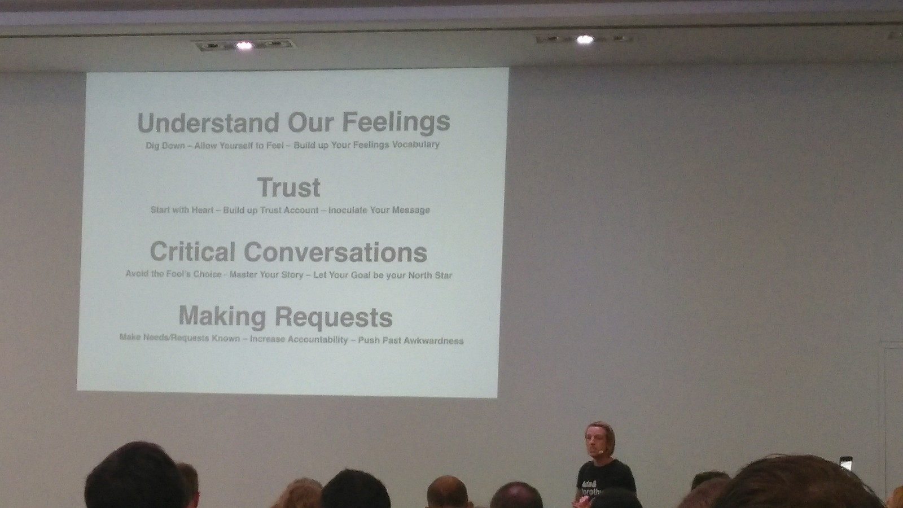
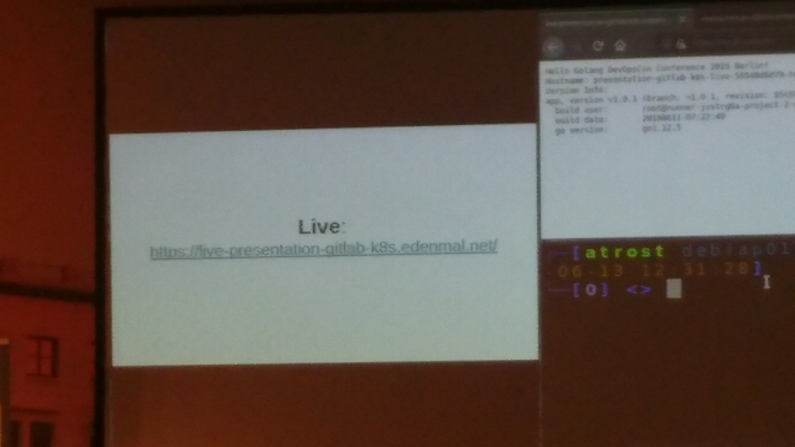
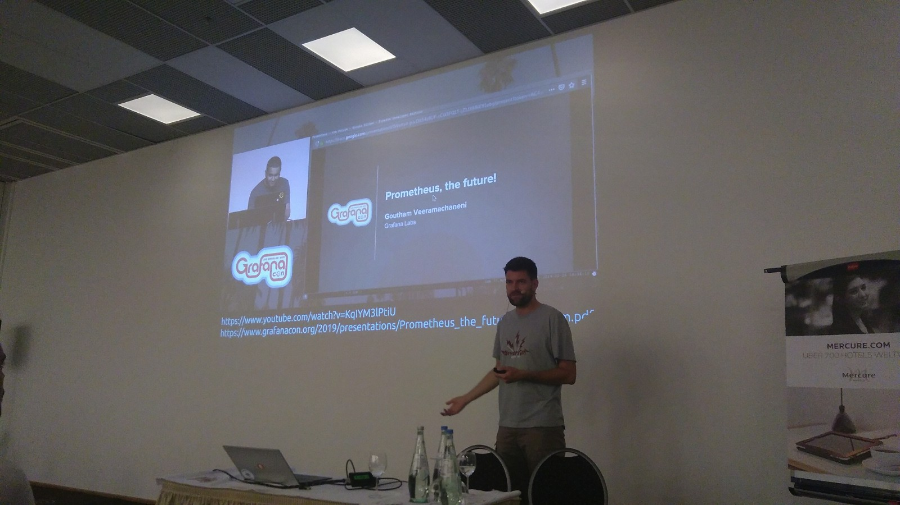
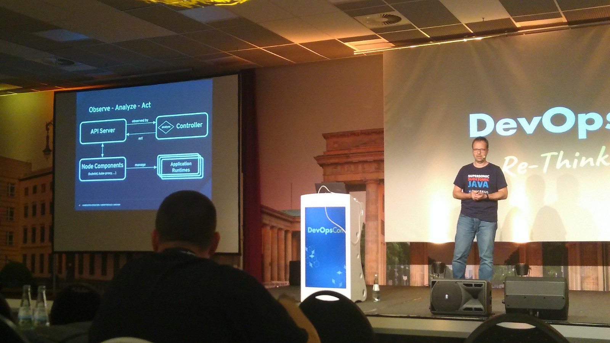

# Devopscon 2019

* https://entwickler.de/contenttype/conference-detail/devopscon-2019-berlin-579897556.html?kiosk=1
* https://devopsconference.de/archive/devopscon-spring-2019/

## Jeff Sussna: Silos are dead. Long live Silos

* https://twitter.com/jeffsussna / @jeffsussna
* https://devopsconference.de/business-company-culture/silos-are-dead-long-live-silos/

* Design Thinking
* Agility: effectiveness to change direction!
* speed is not everything
* flow: idea to product + feedback: get information from production: quality & revelancy
* how to put microservices into coherent whole?
    * mutual service providers
    * Facilitate desirable outcome
    * every level is service provider
        * help each other maximize value
        * understand what the others need (empathy, see things from anothers perspective)
            * people are different
    * Book: Mark Burgess - Thinking in Promises
        * https://www.amazon.com/Thinking-Promises-Designing-Systems-Cooperation-ebook/dp/B01092PYG8
        * Promise: itention, expression, commitment, benefit - a strong intention to facilitate benefit
        * Promises s are broken
        * itentended outcome that may or may not come true
        * Promise-Driven Design
        * are we making the right promises? Which? Do we keep them?
* Book Jeff Sussna - Designing Delivery 

## Basil Faruqui: In Kubernetes, has everyone forgotten application workflows?

* https://devopsconference.de/docker-kubernetes/in-kubernetes-has-everyone-forgotten-application-workflows/

* Werbeveranstaltung mit wenig Informationsgehalt, Sprecher meiden :-D

## Roland Huss: Shell Ninja: Mastering the Art of Shell Scripting #slideless

* https://twitter.com/ro14nd
* https://ro14nd.de/
* https://devopsconference.de/docker-kubernetes/shell-ninja-mastering-the-art-of-shell-scripting/
* https://github.com/ro14nd-talks/shell-ninja

* shell is everywhere
* maybe least common denominator
* fast turnaround
* history
    * 1971 first shell Ken Thomson
    * 1979 Bourne shell by stephen bourne
    * 1979 c-shell
    * 1989 bash brian fox
* Blue green deployment with kubernetes and shell
* `set -eu` # fail on error, fail on undeclared variable - use set +e to disable for commands intendet to possibly fail
* `set -o pipefail` # break pipeline if any and fails
* `ARGS=("$@")` # store command line call
* bash getopts
* Functions können bloß ints zurück liefern, daher werte (zb true/false) ausgeben und eveluaten (letzteres ist mittlerweile scheinbar optional)
* Testing: bats - bash automated testing system

## Stephan Lange: Beyond DevOps – Holistic transformations in uncertain times

* https://devopsconference.de/business-company-culture/beyond-devops-holistic-transformations-in-uncertain-times/

## Slava Koltovich:  How Cloud-native Technologies are shaping Enterprise IT

* https://devopsconference.de/cloud-platforms-serverless/how-cloud-native-technologies-are-shaping-enterprise-it/

## Jan Bruder: Kubernetes access control in the enterprise

* https://devopsconference.de/docker-kubernetes/kubernetes-access-control-in-the-enterprise/
* different authentication options, e.g.
    * client certificate
        * openid connect (e.g. keycloak, google iam,...)
        * auth proxy
            * e.g.Rancher central authentication
* authorization
    * ABAC
        * single file, restart of kubernetes necessary
    * RBAC
        * difficult because you need to know all features
        * cluster-admin <=> sudo => avoid
        * namespaces e.g. for deployment stages, teams
        * clusters e.g. for deployment stages
        * identify user roles (possibly different permissions in different clusters)
        * Subjects, Roles, RoleBinding
* Built-in roles: cluster-admin, admin, edit, view
    * Webhook
* Rancher.com, slack.rancher.io

## Tobias Schneck: $ Kubectl Hacking #slideless

* https://twitter.com/toschneck
* https://www.loodse.com/
* https://devopsconference.de/docker-kubernetes/kubectl-hacking/
* https://github.com/loodse/kubectl-hacking

* Ascii sliudes are also slides ;-)
* No story = no fun :-(
* No story = difficult to remember :-(

## Christian Schneider: Open Source Pentesting and Security Analysis Tools: the DevOps way… #slideless

* https://twitter.com/cschneider4711
* https://www.christian-schneider.net/
* https://devopsconference.de/security/opensource-pentesting-and-security-analysis-tools/

* cvedetails.com
* Exploit-db.com
* ZAP headless with attack mode and selenium (don't forget to limit to specific URL pattern)
* [Jenkinsfile_christian_schneider](Jenkinsfile_christian_schneider)

## Gunner Winkenwerder: The path to agile DevSecOps – a holistic approach of automation, orchestration and correlation

* https://devopsconference.de/security/the-path-to-agile-devsecops-a-holistic-approach-of-automation-orchestration-and-correlation/

## Casie Siekman: How non-violent Communication can help keep the Peace on your Team

* http://www.casiesiekman.com/
* https://www.linkedin.com/in/casie-siekman/
* http://twitter.com/CassandraDanger
* https://devopsconference.de/business-company-culture/nvcnonviolent-communication-how-it-helps-keeping-the-peace-in-your-team/

* How_non-violent_Communication_can_help_keep_the_Peace_on_your_Team.pdf

* understand our feelings
    * formulate feelings precisely to give good understanding
* trust
    * in best interest of feedback giver
    * people might tell themselves negative stories
    * how to build to trust?
        * find things you appreciate in other person, be sure to act in best interest of him/her
        * expression of appreciation
* mastering your own story
    * become aware, own, master
    * verify story
    * pause, take step back, evaluate situation, what fo you want out of conversation?
* make sure that needs and requests are known
    * make unspoken expections explicit
    * >accountability (ask other to agree on request)
* Cause for conflict:
    * opposing feelings
    * strong emotions
    * high stakes
* Book recommendations:
	* https://www.amazon.com/Crucial-Conversations-Talking-Stakes-Second/dp/0071771328
	* https://www.amazon.com/Nonviolent-Communication-Language-Life-Changing-Relationships/dp/189200528X
	* https://www.amazon.com/Five-Dysfunctions-Team-Leadership-Fable/dp/0787960756
* Questions:
    * Do not give feedback when you can not appreciate someone?
    * nice words first, then negative feedback - good idea?

## Alexander Trost: GitLab CI and Kubernetes: deploying Applications continuously to Kubernetes

* https://devopsconference.de/continuous-delivery-automation/gitlab-ci-kubernetes-deploying-applications-continuous-to-kubernetes/

## Damon Edwards: Operations: the last Mile for DevOps

* damon@rundeck.com
* @damonedwards
* https://devopsconference.de/business-company-culture/operations-the-last-mile-for-devops/

* Operations_the_last_Mile_for_DevOps.pdf

* Forces That Undermine Operations
    * Low Trust
        * Descions are not made where the detailed knowledge is, but on a "higher" level
            * But: All Operations work is contextual - "Is this dangerous?" Answer is always
“it depends”
    * Excessive Toil
        * “Toil is the kind of work tied to running a production
service that tends to be manual, repetitive,
automatable, tactical, devoid of enduring value, and
that scales linearly as a service grows.”
    * Silos
        * Silos cause disconnects and mismatches
    * Queues
        * Ticket queues are an expensive way to manage work (Longer Cycle Time, Increased Risk, More Overhead, Less Motivation, ...)
* So what can we do differently?
    * Push the ability to take action to the people directly involved, the experts
    * Reduce Toil
        * Track toil levels for each team
        * Set toil limits for each team
        * Fund efforts to reduce toil
        * https://www.amazon.com/Seeking-SRE-Conversations-Running-Production/dp/1491978864
        * https://www.amazon.com/Site-Reliability-Engineering-Production-Systems/dp/149192912X
    * replace silos by cross-functional teams
        * Shared and dedicated responsibility is the key
    * Self Service Ops: https://www.youtube.com/watch?v=USYrDaPEFtM
    * Reduce Compliance burden: https://www.youtube.com/watch?v=d5IMvK0YHTg
    * Self Service Operations Buch: http://rundeck.com/self-service

## Björn Rabenstein: Prometheus – what’s new and what’s next?

* https://www.linkedin.com/in/bj%C3%B6rn-rabenstein-75367b57/
* https://devopsconference.de/monitoring-traceability-diagnostics/prometheus-whats-new-and-whats-next/

* Future of Prometheus: https://www.youtube.com/watch?v=KqIYM3lPtiU
* https://summerofcode.withgoogle.com/

## Roland Huss: The Status Quo of Kubernetes Operators

* https://ro14nd.de/
* https://twitter.com/ro14nd
* https://devopsconference.de/kubernetes-ecosystem/the-status-quo-of-kubernetes-operators/

* operator is a custom controller
* automates tasks
* http://OperatorHub.io
* e.g. Prometheus Operator to install instance
* Book: Kubernetes Patterns: https://k8spatterns.io/