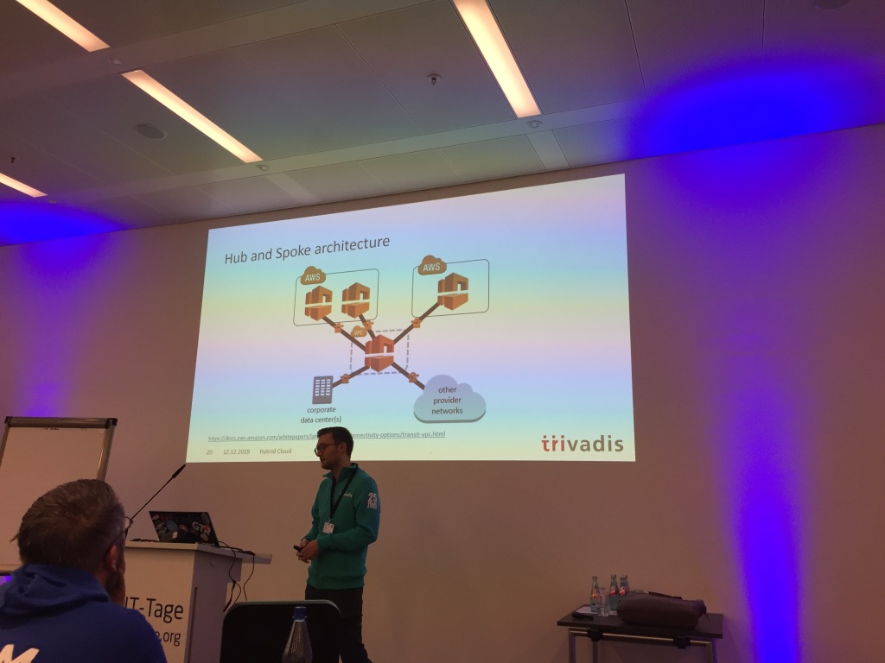
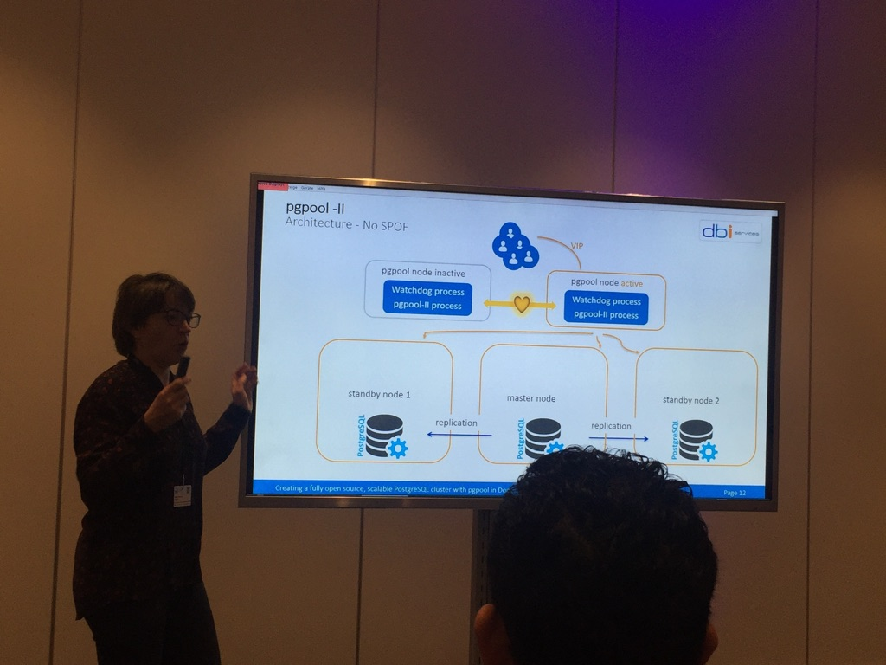
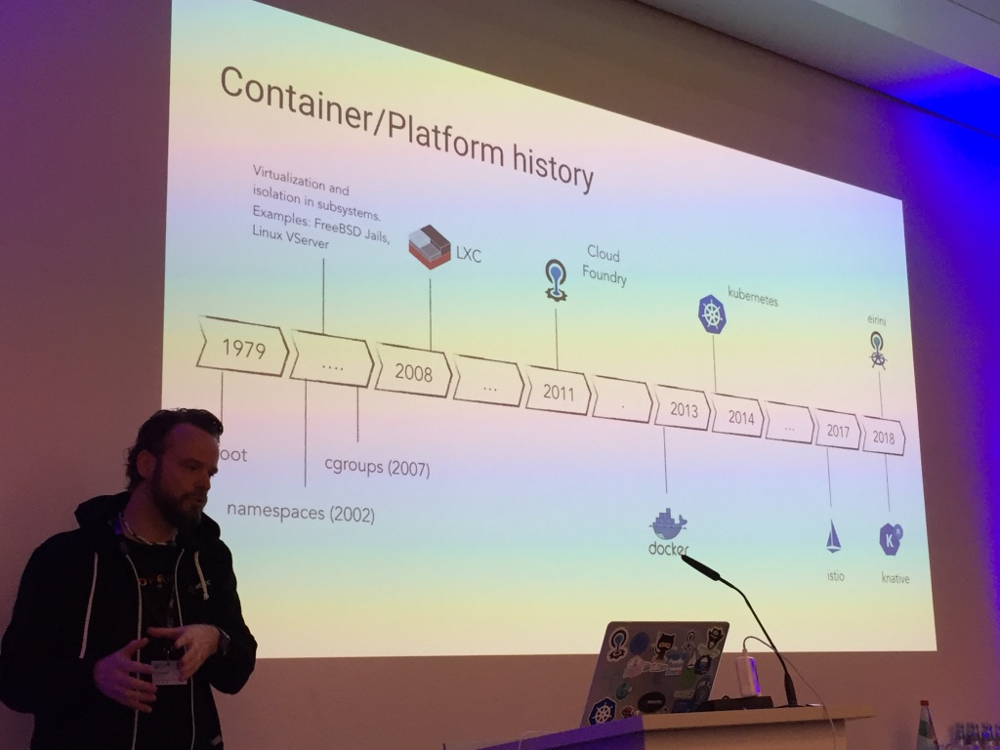
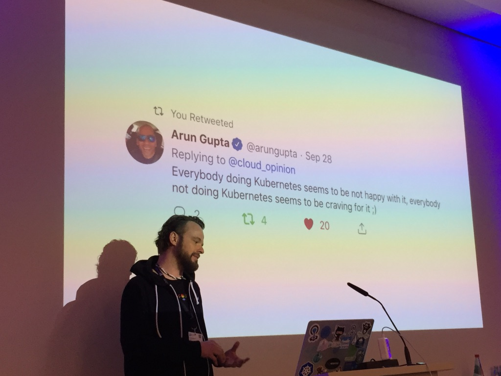
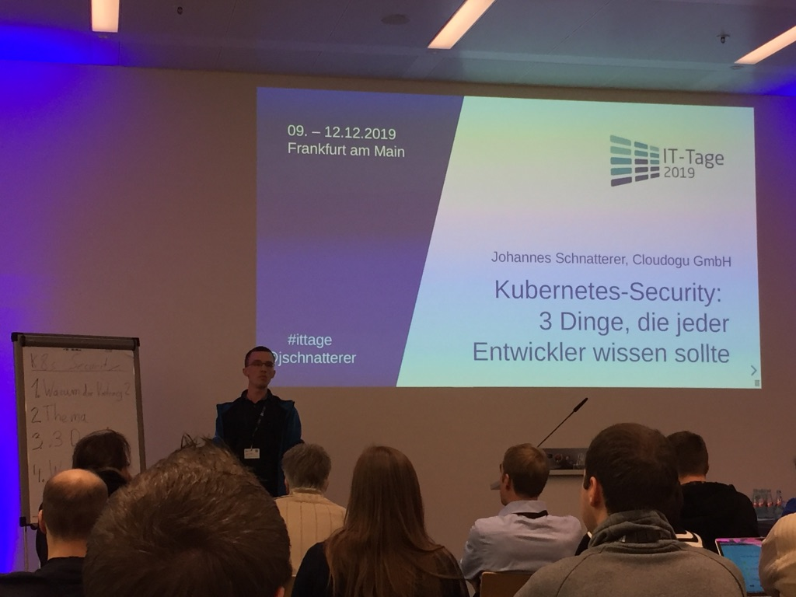

# IT Tage Frankfurt

* https://www.ittage.informatik-aktuell.de/konferenz/it-tage-2019/

## Hybrid-Cloud – Welche Challenges kommen auf uns zu?

* Florian Feicht
* https://www.ittage.informatik-aktuell.de/programm/2019/hybrid-cloud-welche-challenges-kommen-auf-uns-zu/

* Hybrid Cloud
    * 2 oder mehr verschiedene Cloud Infrastrukturen
    * > Deployment
    * muss nicht zwangsläufig public / private sein
    * von den Vorteilen der jeweiligen Cloud profitieren
    * Hochverfügbarkeit / Desaster Recovery
    * Edge Computing
        * => Daten näher an Endkunden heranbringen
            * Wie bindet man das an?
* Multi-Cloud
    * > Cloud-Strategie
* OnPrem
    * Ist On-Prem geschützt genug?
    * Security Konzept
        * welche Absicherungen müssen getroffen werden?
    * VPN
    * Reicht Internetverbindung aus?
        * Durchsatz?
        * Verfügbarkeit?
    * Dedicated connection
        * i.d.r. Externe Partner
        * Angebote
            * AWS direct connect
            * Azure Express Route
            * Google Interconnect
            * Oracle FastConnect
        * [Hub and Spoke Architecture](https://de.wikipedia.org/wiki/Hub_and_Spoke)
        * Cloud Appliance (AWS Outpost, Azure Stack, Oracle Private Cloud Appliance)
* Beste Lösung?
    * Daten Volumen, Protocols and Ports, Bandwidth, Peaks, HA Requirements, User Sound, Security Requirements
* Security
    * Rahmenbedinungen bestimmen! Wer darf was? Wo liegen Daten & Schlüssel?
    * Transport Encryption
    * Authentication
    * Automation of Security Checks
* central services
    * IAM (SSO?)
    * central name resolution
    * usage of file shares
    * Deployment / CI
    * Monitoring & Alerting 

## Skalierbarer PostgreSQL Cluster – komplett mit Open-Source-Komponenten realisiert mit pgpool in Docker-Containern

* Natascha Karfich
* https://www.ittage.informatik-aktuell.de/programm/2019/skalierbarer-postgresql-cluster-komplett-mit-open-source-komponenten-realisiert-mit-pgpool-in-docker-containern/

* HA & Automatic Failover
* pgtool-II
    * connection pooling
    * message queueing
    * cache
    * Watchdog
        * 2 Instanzen überwachen sich gegenseitig
    * automatic failover
* Beispiel:
    * Zugriff über VIP
    * Master -rep-> standby node 1, 2
    * mit docker-compose

## Cloud-Plattformen entmystifiziert: Was können Docker, Kubernetes, Cloud Foundry & Knative?

* Matthias Häussler
* https://www.ittage.informatik-aktuell.de/programm/2019/cloud-plattformen-entmystifiziert-was-koennen-docker-kubernetes-cloud-foundry-knative/
* [Slides](https://drive.google.com/file/d/1GEjNi7DJTOJlnsVt90gCbGxtlSxV2pY9/view?usp=sharing)

* google trends Cloud Foundry vs Kubernetes
* LXC
* [eirini](https://www.cloudfoundry.org/project-eirini/)
    * Cloud Foundry in Kubernetes
* quarks
    * experimentell, noch nicht produktiv
* [Knative](https://knative.dev/)
    * kn service create --image=docker_image
        * => App
        * Objekte: service, config, route
        * revisions für Canary deployments
    * knative tekton

## Kubernetes Security

* Johannes Schnatterer / @jschnatterer
* https://www.ittage.informatik-aktuell.de/programm/2019/kubernetes-security-3-dinge-die-jeder-entwickler-wissen-sollte/
* [Slides](https://drive.google.com/file/d/1dldBg491vR3gMjTP2Njjv16POZgqZkWp/view?usp=sharing)

* RBAC / Role based access Control sollte aktiviert sein!
* Network policies
    * "firewall" for pods
    * restrict ingress / egress traffic
    * enforced by CNI Plugin
    * default: all traffic allowes
    * => Network Policy recipies talk
        * github.com/ahmetb/...
    * Recommendation:
        * for all namespaces except kube-system:
                * deny all connections
                * use whitelist
        * kube-system
            * allow access to kube-dns/core-dns
            * allow external access to ingress
        * egress:
            * allow egress within cluster
            * whitelist pods that access internet
        * Tools neustarten nach network policy change, da bestehende Verbindungen beibehalten werden!
        * https://www.inovex.de/blog/test-kubernetes-network-policies/
        * https://istio.io/blog/2017/0.1-using-network-policy/
* Security Context
    * Enable seccomp security context
    * runAsNonRoot:true
        * runAsUser, runAsGroup > 10000
    * Drop capabilities
        * https://github.com/moby/moby/blob/master/oci/defaults.go#L14-L30
    * Run as unpriviledged user
        * z.B. von bitnami

## TDD zur Hexagonalen Architektur

* Daniel Haftstein

* [uncle bob: button](https://www.youtube.com/watch?v=OrsT94FJOQc)
    * Interface Segregation
