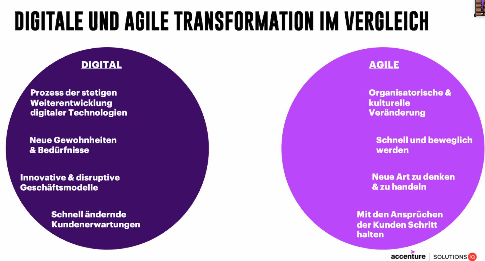
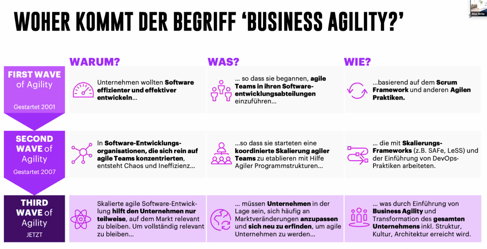

# IT Tage

* https://www.ittage.informatik-aktuell.de/

## Organisation: Die Zukunft der Software-Architektur?
* Slides: ITTage2020@ewolff.com
* https://www.talque.com/app#/app/org/org-event/5MiNavDvNlNGUvVnVu2z/D92FGM94HBko4nTmboWC/info
* Eberhard Wolff
* 2 Architekturdefinitionen
    * Komponenten & Beziehungen
    * Schwer zu ändernde Entscheidungen (Fowler)
* Organization => Architecture
    * Architectecture copies communiation structures of organisations
* Inverse Conway Maneuver
    * Microservices
    * Teams an Hand von Modulen
    * Customer / Supplier Beziehung zwischen Teams
* Kommunkation
    * mache, dass die richtigen Leute miteinander sprechen
        * zB Community of Practice
    * dadurch entstehen Entscheidungen => Architektur
    * Kann man auch als Architekt anregen, man braucht kein Manager dafür zu sein
    * Kommunikation ermöglichen / stärken, anstelle Vorgaben zu machen
* Traditionelle Architektur
    * Architekt entscheidet alles
    * Doof:
        * Overload
        * Architekt kann nicht alle Details kennen
* Wie mache ich das alternativ?
    * Buch: Accelerate (Nicole Forsgren et al)
        * Teams enablen selbst Entscheidungen zu treffen
            * ohne Einfluss auf andere Teams zu haben
        * Tools sind irrelevant
            * wenn Leute sie hassen
            * wenn sie nicht zu den gewünschten Outcomes führen
    * Architekt entscheidet und kommandiert nicht
        * => Architekten sollten keine Architektur machen
        * enablen
        * Team = experts
            * Knowhow über System & Technologien
        * Offer consulting to teams
        * Es geht um Verhaltensänderung
            * => Dojos zu den relevanten Themen
* Konklusion
    * Architektur über Teams Steuern
    * Kommunikation enablen
    * Training & Consulting

## Psychology of Coding – Menschen machen Software
* Slides: 
    * https://www.dropbox.com/s/a6ls26qmekavfwh/PsychologyOfCoding_HeikoSpindler.pdf?dl=0
    * https://drive.google.com/open?id=1ZiIzgDGEeNuCeDhfl0kzAKQSCAhjrsbV
* Heiko Spindler
* hs@heikospindler.de
* "Software Eats the World"
    * https://www.visualcapitalist.com/millions-lines-of-code/
    * Die meiste Software wird von *Menschen* erstellt
* Buch "The Phsycology of Computer Programming" - 1971 :-D
* Agiles Manifest: Mensch im Mittelpunkt:
    * Wie organisieren wir unsere Arbeit im Team?
    * Wie reagieren wir auf Veränderung?
    * Wie passen wir unser Vorgehen flexibel an?
    * Wie setzen wir ein Team zusammen?
    * Wie schaffen wir ein gutes Kommitment?
    * => Fokus "Team"
* Hier: Fokus Individuum
    * Studie: A Look into Programmers' Heads (2018)
        * www.se.cs.uni-saarland.de/publications/docs/PSA+18tse.pdf
        * => es geht mehr um Sprache
            * zB Wörter analysieren & Chunks integrieren
* Experiement:
    * Stadt-Land-Fluss-Variante
    * Zeitdruck reduziert unsere Kreativität
    * Wir suchen einfache, schnell umsetzbare Lösungen
* Buch: Die Logik des Mislingens
* Unterschiedliche Denkarten:
    * Konvergent vs Divergent
    * Tiefgehendes Verständnis & Analyse vs. Lösungen generieren & auswählen
* Chunking
    * erleichtert das Speichern
    * noch besser: Verknüpfung mit Bildern
    * => divide & conquer
    * => passende Namen finden & konsistent halten
* Konesens finden
    * Koventionen festlegen
    * Code Reviews & Pair Programming
* Konformitätsexperiment Solomon Asch
    * => Trends hinterfragen
* Flow
    * Mihaly Csikszentmihalyi
    * Wikipedia

## IT-Security: Digitale Beweissicherung
* Nico Müller
* Ersteinschreiter
    * Admins vor Ort
* Wichtig: Dokumentation
* => Aufklärung von Verdachts- / Vorfällen
    * ggf. Mitteilungspflicht and Kunden / Behörden
    * Verhinderung weiterer, ähnlicher Vorfälle
    * Beweise for Gericht
* Beispiele: Hacker, Sabotage, Daten- weitergabe/Verkauf, -Löschung, -Manipulation, Erpressung, Spionage
* Fragen: Warum? Wie? Was ist passiert? Wie groß ist der Schaden?
* Welche Beweise sind relevant? Wo befinden sie sich? Wie sichere ich sie? ...
* System muss weitestgehend dem Zustand vom Verdachtszeitpunkt entsprechen
    * => Sicherung möglichst zeitnah
* Der *Beweis* ist das Ergebnis eines auf die Feststellung von Tatsachen gerichteten Verfahrens.
* Beweismittel: sämtliche digitalen Inhalte, insbes. logs & Metadaten
* Digitale Beweissicherung: Was? Wann? Wie? Warum?
    * gerichtsverwertbar
* der Forensicsche Bericht
    * Dokumentationstopf (Logbuch, zerntrales Verzeichnis, Dateien)
        * enhält alle Informationen für Techniker und nicht-Techniker
    * Bermerkungen, Darstellung der Untersuchungsobjekte, Analyseumgebung 6 Ablauf, Ergebnisse, Zusammenfassung, ...
* Vorsicht: nicht sichern:
    * strafbares Material
    * Geräte, die nicht dem Unternehmen gehören
    * Private Daten (zB BYOD)
* Wichtig:
    * 4 Augen Prinzip
    * Protokollierung

##  Weniger Chef, mehr Coach: Führung neu gedacht
* Slides: https://drive.google.com/open?id=1BQC9H0--6kOU-XH5sGDJFa4iBzEii7BI
* Leidenschaft: Weiterentwicklung
* Führungsverständnis von Morgen:
    * mehr Spezialisten führen
    * fachliche Expertise nur noch in Bruchteilen bei FK
    * Mehr Facilitating des Arbeitssystems
    * => Mentor, Enabler, Beziehungsmanager
        * => Raum zum Wachsen geben
    * "Freilassen aber nicht ganz loslassen" (?)
* Ansatz: weniger Chef, mehr Coach
    * Vorgehen mit definierten Methoden-Set
    * => Verbesserungspotentiale & neue Möglichkeiten freisetzen
* Schritt 1: Motivation
    * nachhaltige Motivation
    * "higher shared purpose"
        * intaktes Wertesystem
        * starke Leitbilder
        * inspirierende Ziele
    * echte Interesse am gegenüber, Bereitschaft Verantwortung übernehmen
    * Interesse der Kollegen würdigen oder Unternehmensziele kompromittiert werden
    * Vertrauensvorschuss
    * Dienen:
        * befähigen, berstärken
        * Impediments beseitigen
        * schützen vor ungewollter Einflussnahme
    * Führen
        * Leistung, Disziplin & Transparenz fordern & fördern
        * Entwicklung & Abstimmung von Strategien
        * Spezialisten-Netzwerk aufbauen
        * Transpararente, gemeinsame Priorisierung mit Team & Stakeholdern
* Schritt 2: Technik (?)
    * sicherstellen, dass Mitarbeiter verstehen was von ihnen erwartet wird
        * Mögliche Probleme:
            * Erwartungen & Werte nicht klar kommuniziert
            * Wichtigkeit / Dringlichkeit nicht klar kommuniziert
            * Resourcen nicht vorhanden
            * Fragen nicht geklärt
        * Mögliche Fragestellungen:
            * Identifizieren
                * Wie würden sie das Projekt angehen?
                * Welche Projekte haben sie sonst noch parallel?
                * Welche Ziele verfolgen sie als erstes?
                * Wer könnte sie dabei unterstützen?
            * Quantifizieren
                * Welche Herausforderungen gibt es?
                * Was können Sie tun um den Erfolg zu sichern=
                * Welche Möglichkeiten haben Sie ausgeschöpft?
                * Welche Alternativen hat der Kunge?
            * Validieren
                * Funtkioniert alles?
                * Hat der Kunde der Lösung zugestimmt?
                * Gibt es Fragen oder Bedenken=
                * Haben sie Feedback bekommen=
                * Wie würde der Kunde die Situation einschätzen?
            * Sichern
                * Welches sind die nächstes Schritte?
                * Welche Bedanken hat der Kunde?
                * Was haben wir gelernt?
* Schritt 3: Timing
    * Den richtigen Zeitpunkt finden um Dinge anzustoßen
    * kontinuirlich überwachen & bewerten: sind wir erfolgreich?
    * Informationsfluss fördern um den Erfolg zu steigern
    * => Meetings (Vorbereitung, Nachbereitung etc)
    * Teammeeting:
        * Power Pitch (5-10 min)
            * Möglichkeit geben Erfolge den anderen Vorzustellen
        * Kundennutzen erörtern
        * Einwandbehandlung
            * Im Team ansprechen & erörtern
    * Vorbereitungsmeeting: Aktuelle Lage, Proble, Nutzen, Was wollen wir erreichen?
    * Nachbereitungsmeeting: Was haben wir gelernt? Neue Schmerzen / Herausforderungen? Top 3 TODOs?
* Schritt 4: Balance
    * Beständigkeit: Etablieren von Routinen & Ritualen
    * Verantwortlichkeit: Zeit Investieren & Vorbereitung
    * Dinglichkeit: Inspect & Adept, nach Notwendigkeit / Berdürfnis
* Takeaway
    * Servant Leader sein
    * Motivation fördern
    * ehrliches Interesse zeigen
    * die richtigen Fragen stellen

## Innovation und Erfolg durch Digitalisierung und agile Unternehmenskultur
* https://www.talque.com/app#/app/org/org-event/5MiNavDvNlNGUvVnVu2z/QWGt4Hl8bEc79u2rTbb9/info
* Mark Hlawatschek
* => wieder rausgegangen

## Resilient Software Design Patterns

* https://www.talque.com/app#/app/org/org-event/5MiNavDvNlNGUvVnVu2z/6jVFrbeYqmQvgMrxZt3x/info
* Thorsten Maier (Trivadis)
* Verfügbarkeit = MMTF / (MTTF + MTTR)
    * Mean Time to Failure (früher: => unendlich)
    * Mean Time to Recovery (heute: => 0)
* Things will crash => Deal with it!
    * => Resilient Software Design
    * Redundanz
    * Isolation
        * Bulkheads
            * Methodenaufrufe:
                * Parameter Validieren, Vorbedingungen etc
                * freundliche Rückgabewerte (zB nie null, Datenmengen beschränken)
            * Software-Bausteine / Microservices
                * Isolation (Entwicklung, Fehler, Deployment)
                * Nachteil: verteilte Welt (Netzwerk & Co)
                    * 8 Irrtümer der verteilen Datenverarbeitung: Netzwerk ausfallsicher, Latenzz = 0, Datendurchsatz unendlich, Topologie stabil, 1 Admin, Homogene Topologie etc.
                * => wie kommen die Teile wieder zusammen?
    * Lose Kopplung
        * asynchron
            * Fehlerketten werden unterbrochen
            * Sender wartet nicht auf Empfänger
            * Eventual Consistency
            * Idempotenz vs Exactly Once Kommunikation
        * vs synchron
            * ermöglicht Strict Consistency
            * Verzeichnisdienst + Client Side Load Balancing
    * Fallback
        * circuit breaker (ggf + Client Side Load Balancing & retry)
    * Zentrale Dienste
        * zentrale Konfiguration

## Business-Agilität – Der lange Weg und seine Stolpersteine
* https://www.talque.com/app#/app/org/org-event/5MiNavDvNlNGUvVnVu2z/epqsiACg2F7okGrD5pFN/info
* Alexander Birke, Sebastian Straube (accenture Solutions IQ)
* 
* 

## Einblick in die Blackbox "Machine Learning"
* https://www.talque.com/app#/app/org/org-event/5MiNavDvNlNGUvVnVu2z/OOctclOWCtlgns5RuRLJ/info
* Slides: https://drive.google.com/open?id=1tHANWj6H20oDo-wzi9cO4sclZTUA3Dtm
* Dennis Netzer, Georg Frey, Valerie Restat
* Train (fit) / Predict
* Modell (e.g. Lineare Regression), Parameter, Fehlerterm
* Neuronales Netz
    * Wieghted Inputs, Bias
    * Summierung, Aktivierung, Output
    * Input Layer
        * Attribute => Neuronen
    * Hidden Layer
        * n hidden Layer, m Neuronen
    * Output Layer
        * Vorhersage 1 oder Multidimensional
* Libs: Tensorflow, Keras
* Blog: blog.ordix.de/
    * TensorFlow & Keras
        * https://blog.ordix.de/technologien/einstieg-in-neuronale-netze-mit-tensorflow-und-keras

## Systemisch-agile Softwareentwicklung
* https://www.talque.com/app#/app/org/org-event/5MiNavDvNlNGUvVnVu2z/bxf63iJj2ZS76ODkFrkz/info
* Dr. Christian Mennerich, Frederick Meseck
* Systemisch: Systemtheorie nach Niklas Luhmann
* Es gibt keinen Objektiven Standpunkt, Beobachter ist immer teil der Beobachtung
* Sind gut in vorschnellen Schlussfolgerungen
* Jeder Konstruiert sich seine eigene Realität
* Kunst: die verschiedenen Realitätskonstruktionen übereinander bringen
* Soziales System
    * häufige Kommunikation: wird relevatn und kann neues Soziales System bilden
    * Soziales System = Bounded Context?
* => Realitätskonsenz
    * wird iterativ angeglichen, Konsenz zwischen allen Beteiligten
* Systemische Fragen
    * Woran würden sie am Ende des Tages erkennen, dass sie einen gelungenen Arbeitstag hatten?
    * Was ändert sich, wenn XY anwesend ist?
    * Wer muss mit wem reden, damit ein gutes/schlechtes Ergebnis entsteht?
* Konsenz von Software und Anwender hoch: vermutlich hohe Akzeptanz

## Mit Chaos Engineering komplexe Softwaresysteme robust machen
* https://www.talque.com/app#/app/org/org-event/5MiNavDvNlNGUvVnVu2z/qveWA1pBGxpzniuviHGn/info
* Slides: https://maikfigura.gitlab-pages.codecentric.de/mit-chaos-engineering-resiliente-software-gestalten-2020-it-tage-slides/#/_mit_chaos_engineering_robuste_softwaresysteme_gestalten
* Maik Figura
* Wert Chaos Engineering
    * ^ Time to Recovery
    * v Time to Recovery
    * v Waste (zB technische Schulden, Bugs) https://theleanway.net/The-8-Wastes-of-Lean
* Resilienz
    * Robust (ua auch Bus-Faktor)
    * Adaptiv: Auswirkungen minimal, Selbstheilung & Circuit Breaking
    * Transformierbar: Wartbar- und Veränderbarkeit (Einfachheit grundsätzliche Entscheidungen zu ändern)
* Vorgehensweise
    * Experiment planen
        * Hyptohese aufstellen
        * Baseline festlegen und messen
        * Angriffsplan
        * Messen
    * Experiment durchführen
    * Ergebnisse sichern
* Tipps
    * Experimentieren anstatt testen (Hyphothesen aufstellen & Validieren)
    * Validieren statt verifizieren (evtl mal in https://www.plutora.com/blog/verification-vs-validation anschauen)
    * Messen was die Downtime kostet (=> sonst muss evtl nichts getan werden)
    * Nicht in PROD anfangen ;-)
    * Machen statt nur darüber nachdenken
* Gameday
    * Alle Personen mit wichtigen Stakes sind mit dabei
    * measure cost of downtime
    * continuously host gamedays
    * *automate most important experiments*
* => Regelmäßiges Sicherstellen der Resilienz (Robust-, Transformierbar-, und Adaptierbarkeit)

## AWS Cloud Development Kit (CDK): Die Zukunft der Software- und Infrastrukturentwicklung
* Dr. Sven Seiler, Henning Teek
* => Raus gegangen

## Apache Kafka: Architektur-Pattern für verteilte, hybride und globale Apache Kafka Deployments
* https://www.talque.com/app#/app/org/org-event/5MiNavDvNlNGUvVnVu2z/D2zKuuJKFtEpwtwPnrc6/info
* Kai Wähner
* Kafka Cluster
    * Zookeeper
    * Kafka Broker
    * Optional
        * Schema Registry
        * Kafka Connect
        * Rest Proxy
* Nächstes Jahr: Zookeeper wird entfernt
* Desaster Recovery
    * Recovery Point Objective (Zero Data Loss)
    * Recovery Time Objective (Zero Downtime)
* Single Kafka Cluster
    * Hochverfügbarkeit
        * 3 * Broker & ZK
        * 2 * Schema Registry & Co
        * 3 Data Centers: zB 3 AZ in 1 Region
            * Gute Latenz nötig
        * 2 Data Centers:
            * Quorum in 2 DC is not possible
* Multiple Kafka Clusters
    * Replikation
        * Confluenct Replicator
        * Mirror Maker
        * von confluent nicht empfohlen:
            * uReplicator
            * Mirus
            * Brooklin
* Confluent Cluster Linking
    * no kafka connect etc required
    * noch im Preview

## How to ensure Testing Robustness in Continuous Testing Environments
* https://www.talque.com/app#/app/org/org-event/5MiNavDvNlNGUvVnVu2z/dhtj9hVVJWY5SCPnpaMs/info
* Eylul Akar, Mesut Durukal
* Flaky Test
    * Async Wait ~ 30 %
        * => Retry / Enventually
        * Cleanup
    * Suite Dependency
        * Testgroup (why does this help?)
    * Cover Execution Environments
        * Selenium Hub
* => Raus gegangen

## Domain-driven Design – Deep Dive
* https://www.talque.com/app#/app/org/org-event/5MiNavDvNlNGUvVnVu2z/rL02FDJcGwR2Ia41kDHk/info
* Hermann Woock
* Kompliziert vs Komplex
* > Wannen-Bild
* Frühe Einbeziehung des Kunden
    * Domänenexperte sitzt im Team
    * Ubiquitous Language
* => Raus gegangen

## Autonomes Fahren und Open-Source-Technologien – Ist das eine gute Idee?
* https://www.talque.com/app#/app/org/org-event/5MiNavDvNlNGUvVnVu2z/tf6cQfBB5Ifp29ZXBOFc/info
* Andreas Riexinger
* Warum?
    * Erhöhung der Sicherheit
    * Demokratisierung der Mobilität
    * Höhere Effizienz (angeblich 39% kraftstoffersparnis)
    * Staureduktion (angeblich 80% Verbesserung Verkehrsfluss)
    * Erhöung der Produktivität (naja ...)
* Komplexität
    * Sense
    * Locate
    * Think, Perceive & Plan
    * Act
* Herausforderungen
    * Tools sind nicht auf Interoperabilität ausgelegt
    * Hohe Kosten für Adapter
* OpenADx
    * Open Autonomous Driving  EXcelleration

## Wie wir unsere Welt verändert haben!
* https://www.talque.com/app#/app/org/org-event/5MiNavDvNlNGUvVnVu2z/f95byxDWjwARukpxMyG9/info
* Dr. Carola Lilienthal
* => Raus gegangen

## Flexible Software-Architekturen: Mit der Zeit gehen
* https://www.talque.com/app#/app/org/org-event/5MiNavDvNlNGUvVnVu2z/VIMPkpBAGHWHFAcOWZLQ/info
* Falk Sippach
* ISAQB
* Flexibel
    * Skalierbar
    * Elastisch
    * Freie Technologiewahl
    * Austauschbar
    * ...
* Top 3 bis Top 5 Prioritäten festlegen
* => Raus gegangen

## Pact Wars – die Rebellion der API-Consumer
* https://www.talque.com/app#/app/org/org-event/5MiNavDvNlNGUvVnVu2z/VaOMOWryEsAKzeOar8Jj/info
* Kevin Kessenich, Marcos Scholtz
* Slides: https://cofinpro.gitlab.io/Tech/konferenzen/pact-wars/
* Code: https://gitlab.com/Cofinpro/Tech/konferenzen/pact-wars/
* Contracts
* Ansätze
    * Provider First
    * Contract First
        * Contract schreiben, zb openapi.yml
    * Consumer-First ("Consumer-Driven")
        * Consumer schreibt Contract
        * Jeder Consumer bekommt evtl seinen eigenen Contract
* Stolpersteine
    * Keine Prio, keine Zeit
        * keine Tests, oder keine Provider-Tests
            * Aufnehmen in DOD?
            * Vorbedingung mit Merge?
    * Roter Test wird Ignoriert
        * Vorbedingung mit Merge?
    * Provider-Teams werden durch Consumer-Änderungen blockiert
        * Pending Pact
* Pact kann auch Messaging :-)
    * => Message Pacts
* Dokumentation aus Pact generieren?

## Die Gemeinwohlökonomie: ein Wirtschaftsmodell für unsere Zukunft
* https://www.talque.com/app#/app/org/org-event/5MiNavDvNlNGUvVnVu2z/K7Bt09BvPp0BbrkDWcCh/info
* Ute Haedke
* Slides: https://drive.google.com/open?id=1NnCc3DEP_7lFQK5EkdieihQtYDlfWUEU
* https://web.ecogood.org/de/
* https://web.ecogood.org/de/rhein-main/

## Dokumentation in der IDE schreiben? Klar, mit AsciiDoc!
* https://www.talque.com/app#/app/org/org-event/5MiNavDvNlNGUvVnVu2z/tuYOxVFH7IkaWhoEdCL1/info
* Alexander Schwartz
* https://asciidoc-editor.ahus1.de/#/edit
* Womit Dokumentation schreiben?
    * Office Suite
    * asciidoc
* https://asciidoctor.org/
* Plugin für Idea!
* Integration in gitlab!
* Diagramme
    * https://www.diagrams.net/
    * https://asciidoctor.org/docs/asciidoctor-diagram
    * ditaa
* Swagger => Konvertierung nach Asciidoc
* https://github.com/asciidoctor
* https://github.com/asciidoc/asciidoc

## The Art of Coaching: Die systemische Sichtweise auf Impediments
* https://www.talque.com/app#/app/org/org-event/5MiNavDvNlNGUvVnVu2z/YauEuqND7InI2jLA6MHH/info
* Dr. Markus Blaschka
* Slides: https://drive.google.com/open?id=1_JZuObFQ73umgxJoWBNJFBNrqXIvogfx
* Experte vs Coach
* "Alle Fragen der Selbstorganisation sind im Kern Konflikte"
    * mit sicher selbst oder der eigenen Rolle
    * mit anderen Menschen (im Team)
    * mit der Kultur, den Werten, dem Unternehmen
* Konflikte müssen (sollten) wir klären!
    * Konflikt bewusst machen
    * Professionelle Belgeitung kann hilfreich sein
    * Aber: wenn wir zu sehr auf der fachlichen Ebene bleiben, kommt das Team nie an den wahren Konflikt
    * Coaching Diamant
        * Hinter jedem Thema liegt ein Thema
        * Trust (ins sich selbst, die Gegebenheiten?), Awareness (Worum geht es?), Choice (Welches sind die Möglichkeiten?), Action (ins Tun kommen), Learning (?)
        * Mögliche Probleme
            * Bedürfnisse (Anerkennung, Teilhabe, Autorität, Wirksamkeit, ...)
            * Wertkonflikte
            * Überlastung
            * Antipathie
        * Wie kommen wir zum Konflikt hinter dem Problem?
            * Courage, Focus, Commitment, Respect, Openness
* Qualität der Beziehung ist ausschlaggebend
    * => Innere Haltung
        * Systemisch
        * Lösungsfokussiert
        * Konstruktivistisch
        * wichtig:
            * Neugier
            * Empathie
            * Wertschätzung
        * Ask, don't tell
        * Mehr Optionen finden als im Dilemma
        * Den Elefanten im Raum ansprechen
        * Anerkennen was ist, Acceptance
* Werkzeuge
    * Ressourcen-fragen (Woher könnte man noch weitere bekommen?)
    * Verschlimmerungs-fragen (Was könnte man tun ums schlimmer zu machen?)
    * Zirkuläre Fragen (Was würde XY sagen? Auch Dinge)
    * Skalierung / Hypothesen
* Selbstorganisation
    * => Verantwortung übernehmen
    * Häufig sind Agile Coaches zu fachlich unterwegs => Experten-Falle
        * => mehr Coach, weniger Experte!

## Ideen
* https://www.talque.com/app#/app/org/org-event/5MiNavDvNlNGUvVnVu2z/jM88uWpyEI5mmc9HOFTB/info
* Lesen: Wie Wirklich ist die Wirklichkeit?
* Lesen: https://theleanway.net/The-8-Wastes-of-Lean
* Quorum?
* pact für go anschauen
* Go REST Interface aus PACT contract generieren?
* Pact => Swagger => Asciidoc?
* Zertifizierungsprozess für die tarent anstarten <=