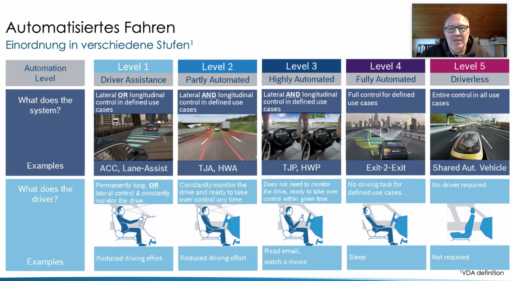

# Key Learnings IT Tage 2020

## Organisation: Die Zukunft der Software-Architektur?
* Eberhard Wolff
* 2 Architekturdefinitionen
    * Komponenten & Beziehungen
    * Wichtige & schwer zu ändernde Entscheidungen (Fowler)
* Alternative zum alles-Entscheider-Architekt:
    * Architektur über Teams Steuern
    * Kommunikation enablen
    * Training & Consulting

## Psychology of Coding – Menschen machen Software
* [Heiko Spindler](mailto:hs@heikospindler.de)
* Beim Coding geht es viel um Wörter analysieren & Chunks integrieren
    * Chunking erlichtert das Speichern (am besten mit Bildern) 
* Experiment:
    * Stadt-Land-Fluss-Variante
    * Zeitdruck reduziert unsere Kreativität
    * Wir suchen einfache, schnell umsetzbare Lösungen

## IT-Security: Digitale Beweissicherung
* Nico Müller
* Wichtig:
    * Dokumentation / Protokollierung
    * möglichst keine Änderungen vom "Tatort"
    * 4 Augen Prinzip
* Fragen: 
    * Warum? Wie? Was ist passiert? Wie groß ist der Schaden?
    * Welche Beweise sind relevant? Wo befinden sie sich? Wie sichere ich sie, möglichst ohne sie zu ändern? Wie übergebe ich die Beweise sicher und vollständig dem Forensiker?
* der Forensicsche Bericht
    * Dokumentationstopf (Logbuch, zerntrales Verzeichnis, Dateien)
    * Bermerkungen, Darstellung der Untersuchungsobjekte, Analyseumgebung & Ablauf, Ergebnisse, Zusammenfassung, ...

##  Weniger Chef, mehr Coach: Führung neu gedacht
* Nadine Pauer
* Mentor, Enabler, Beziehungsmanager
    * Raum zum Wachsen geben
* 1: Motivation
    * "higher shared purpose" (intaktes Wertesystem, starke Leitbilder, inspirierende Ziele)
    * Servant Leader: Selbstlos, offen, interessiert, unterstützend, vertrauend
* 2: "Technik" (nesserer Name: Transparenz !?)
    * sicherstellen, dass Mitarbeiter verstehen was von ihnen erwartet wird
    * Durch Fragen herausfinden (aus verschiedenen Perspektiven):
        * Verständnis
        * Herangehensweise
        * Probleme & Hindernisse
        * Lösungsoptionen & Alternativen
        * Resourcen & Unterstützung
        * Feedback-Fluss & Kommunikation
        * Learnings
        * wie geht es weiter?
* 3: Timing
    * Den richtigen Zeitpunkt finden um Dinge anzustoßen
    * kontinuirlich überwachen & bewerten: sind wir erfolgreich?
    * Informationsfluss fördern um den Erfolg zu steigern (zB Meetings)
* 4: Balance zwischen
    * Beständigkeit: Etablieren von Routinen & Ritualen
    * Verantwortlichkeit: Zeit Investieren in Kollegen, ohne Fokus zu verlieren
    * Dinglichkeit: Anpassen an aktuelle Situation
* Takeaway
    * Servant Leader sein
    * Motivation fördern
    * ehrliches Interesse zeigen
    * die richtigen Fragen stellen

## Systemisch-agile Softwareentwicklung
* [Dr. Christian Mennerich](mailto:mennerich@synx.de), [Frederick Meseck](meseck@synx.de)
* Systemisch: Systemtheorie nach Niklas Luhmann
* Es gibt keinen Objektiven Standpunkt, Beobachter ist immer teil der Beobachtung
* Sind gut in vorschnellen Schlussfolgerungen
* Jeder Konstruiert sich seine eigene Realität
* Kunst: die verschiedenen Realitätskonstruktionen übereinander bringen
* Soziales System zeichnet sich aus durch
    * Systemgrenze
    * Kommunikation
    * Autonomie, Operative Geschlossenheit & Selbstorganisation
    * Muster, Regeln & Prozesse

## Mit Chaos Engineering komplexe Softwaresysteme robust machen
* Maik Figura
* Ziel: Resilienz erhören (Robustheit, Adaptivität & Transformierbarkeit)
* Mittel: Störungen simulieren / herbeiführen
* Hyphothesen aufstellen & Validieren
* Ablauf: Planung, Durchführung, Sicherung
* Tips:
    * Messen was die Downtime kostet (=> sonst muss evtl nichts getan werden)
    * Nicht in PROD anfangen ;-)
    * Machen statt nur darüber nachdenken
* Gameday (regelmäßig mit allen Stakeholdern)

## Autonomes Fahren und Open-Source-Technologien – Ist das eine gute Idee?
* Andreas Riexinger
* Warum?
    * Erhöhung der Sicherheit
    * Demokratisierung der Mobilität
    * Höhere Effizienz (angeblich 39% kraftstoffersparnis)
    * Staureduktion (angeblich 80% Verbesserung Verkehrsfluss)
* 

## Dokumentation in der IDE schreiben? Klar, mit AsciiDoc!
* Alexander Schwartz
* https://asciidoctor.org/
* Plugin für Idea!
* Integration in gitlab!

## The Art of Coaching: Die systemische Sichtweise auf Impediments
* Dr. Markus Blaschka
* "Alle Fragen der Selbstorganisation sind im Kern Konflikte"
    * mit sicher selbst oder der eigenen Rolle
    * mit anderen Menschen (im Team)
    * mit der Kultur, den Werten, dem Unternehmen
* Konflikte müssen (sollten) wir klären!
    * manchmal wird der Konflikt auf fachlicher Ebene ausgetragen, obwohl er zB auf Bedürfnisebene liegt
        * => Konflikte auf richtiger Ebene angehen!
* Systemischer Coach: innere Haltung:
    * offen (neugierig, empathisch & wertschätzend),
    * lösungsfokussiert
    * konstruktivistisch
    * Ask - don't tell
    * Mehr Optionen finden als im Dilemma
    * Den Elefanten im Raum ansprechen
    * Anerkennen was ist, Acceptance
* Werkzeuge
    * Ressourcen-fragen (Woher könnte man noch weitere bekommen?)
    * Verschlimmerungs-fragen (Was könnte man tun ums schlimmer zu machen?)
    * Zirkuläre Fragen (Was würde XY sagen? Auch Dinge)