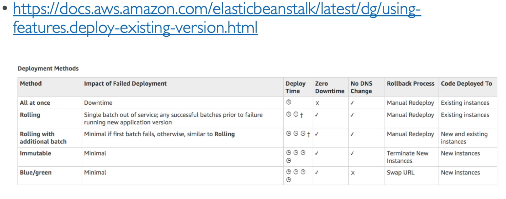

# AWS Certified Developer Associate

* https://www.udemy.com/course/aws-certified-developer-associate-dva-c01/
* https://stephanemaarek.com/
* https://aws.amazon.com/de/certification/certification-prep/
* Slides & Code: https://drive.google.com/open?id=17XcwcDiU_Twynr3zq0iR_Sp6zA7TjEcf

## Regions

Regions - Availability Zone ~data center
https://aws.amazon.com/de/about-aws/global-infrastructure/

## IAM

* user - group - role (machine)
* SAML Standard (Active directory) https://de.wikipedia.org/wiki/Security_Assertion_Markup_Language
* Security Group: Region Scoped

## EC2

* SSH Connect to EC2 Instance

        ssh -i ~/config/aws/TimsEC2InstanceKeys.pem ec2-user@3.122.55.45

    => Connect  => SSH Client

* Security Group <=> Firewall
* Elastic IP: Fixed IP for EC2 instances
* On Demand: Elastic workload
* > Dedicated Host vs Dedicated Instance?
* ENI: Elastic Network Interface
    
    https://aws.amazon.com/blogs/aws/new-elastic-network-interfaces-in-the-virtual-private-cloud/
* EC2 Pricing https://aws.amazon.com/ec2/pricing/on-demand/
* EC2 Instances: https://ec2instances.info/ 
* AMI: Amazon Machine Image
* User Data (provisioning script) example:

        #!/bin/bash

        yum update -y
        yum install -y httpd.x86_64
        systemctl start httpd.service
        systemctl enable httpd.service
        echo "Hello World from $(hostname -f)" > /var/www/html/index.html

* EBS Elastic Block Store
    * Easy backup
    * Linux Befehle:

            lsblk

    * https://docs.aws.amazon.com/AWSEC2/latest/UserGuide/ebs-using-volumes.html

    * GP2 Volume
        * General Purpose
        * 1Gb - 16 TB
        * Burst to 3000 (for small)
        * IOPS depend on Volume (3 IOPS per GB, max 16000)
    * IO1
        * high IOPS requirement, e.g. DB
        * 4 GB - 16 TB
        * PIOPS: 100 - 32k (64k for nitro)
        * Max PIOPS : GB => 50:1
    * ST1
        * Streaming Workloads, fast throughput, low price
        * DWH, Kafka etc
        * 40MB/s per TB, Max 500MB/s
    * SC1
        * throught oriented, less frequently accessed
        * cheaper than ST1
        * 12MB/s per TB, Max 250MB/s 

* Local EC2 Instance Store
    * physical disk attached to machine
    * high IOPS

## EFS
* Elastic File System
* Manages NFS, multi-AZ
* HA, Scalable, Expensive, Pay Per Use
* Linux only
* Performance Mode
    * GP (low latency)
    * Max I/O
* Tiers
    * Standard
    * EFS-IA: infrequent access, lower price but restore fee
* https://docs.aws.amazon.com/efs/latest/ug/mounting-fs.html

## RDS

* Relational Database Service
    * Postgres
    * MaySQL
    * MariaDB
    * Oracle
    * Microsoft SQL Developer
    * Aurora
* Backups:
    * Daily
    * Transaction logs @ 5 min
    * up to 35 days
* Manual Snapshots

### Read Replicas & Multi AZ
* Read Replicas
    * up to 5
    * within AZ, Cross AZ, Cross Region
    * ASYNC, eventually consistent
    * desired instances in connection String
    * can be promoted to own DB
    * Network cost: data exchange between AZs
    * Can be setup to multi AZ for desaster recovery

* Multi AZ
    * SYNC replication
    * One DNS + failover

* Encryption
    * at rest encryption
        * master must be encrypted for read replica encryption
    * in-flight encryption (SSL)
        * Postgres: parameter group: rds.force_ssl=1
        * MySQL: Within the DB: GRANT USAGE ON *.* TO 'mysqluser'@'%' REQUIRE SSL;
    * encrypt unencrypted DB
        * create Snapshot
        * copy & encrypt snapshot
        * restore to new encrypted DB from encrypted snapshot
    * Postgres does not provide TDE

* Access Management: Login:
    * usname / password
    * IAM for MySQL, Postgres Aurora

### Aurora

* performance boost: 5x MySql, 3x Postgres
* 6 Instances
    * 3 AZ
    * 1 Master
    * 5 Read Replicas
    * failover in less than 30 sec
* requirements:
    * writes: 4 / 6
    * reads: 3 / 6
* enpoints
    * writer
    * reader
        * connection LB
* Aurora
    * Serverless
    * Cross Region (?)
    * Global
* select global reader / writer endpoint for access

### AWS ElastiCache

* Redis
* memcached
* write / read scaling
* multi-AZ
* caching Pattern
    * Lazy Loading / Cache-Aside / Lazy Population

## Route 53

* A: hostname => IPv4
* AAAA: hostname => IPv6
* CNAME: hostname to hostname
* Alias: hostname to AWS resource
* nslookup / dig
* TTL: konfigurierbar in Route53

* Routing Policies:
    * simple
    * weighted
    * latency
    * Failover
    * Geo Location
* health checks
    * unhealthy after X checks failed (default 3)
    * heathy after X checks apssed (default 3)
    * Default Interval 30s (up to 10s for more $)
    * ~15 health checkers running in parrallel

## VPC

* only in 1 regions
* Subnets
    * Tied to AZ (one? really!?)
    * private
    * public
* CIDR https://en.wikipedia.org/wiki/Classless_Inter-Domain_Routing
* default VPC: only 1 public subnet
* Internet gateway (internet access VPC)
* NAT-Gateway / NAT-Instances
    * deployed in public subnet
    * acces to internet from private subnet
* NACL
    * Network Access Control List
    * Firewall in/out traffic subnet
* VPC Flow Logs!
    * can be sent to S3 / Cloud Watch
* VPC peering
    * IP ranges should not overlap!
    * not transitive!
* VPC Endpoints (Gateway/Interface)
    * private access to AWS services
* Site to Site VPN vs Direct Connect 

## S3

* Buckets are defined at the region level
* > 5GB => multipart uploads
* Versioning possible
* S3 Encryption
    * SSE-S3: AWS Keys (AES-256)
        * Header "x-amz-server-side-encryption": "AES256"
    * SSE-KMS: KMS Keys
        * key access control & audit
        * Header "x-amz-server-side-encryption": "aws:kms"
        * uses KMS Customer Master KEy (CMK)
    * SSE-C: Own Keys
        * Amazon does not store keys
        * https must be used
        * encryption key in header
    * Client-Side Encryption
        * eg amazon S3 encryption client
* S3 Security
    * User based / IAM
    * Resource Based: 
        * Bucket Policies
        * Object ACL - finer grain (not relevant)
        * Bucket ACL - less common (not relevant)

## CLI & Stuff

    aws configure
    ~/.aws/config
    ~/.aws/credentials

* Generator: https://awspolicygen.s3.amazonaws.com/policygen.html
* Simulator: https://policysim.aws.amazon.com/
* Test if command would succeed

        --dry-run

* STS: Security Token Service  (temporary, limited-priviledge credentials)
    * decode authorization message https://docs.aws.amazon.com/cli/latest/reference/sts/decode-authorization-message.html
    * sts get-session-token for MFA

        aws sts decode-authorization-message ...

* AWS EC2 Instance Metadata http://169.254.169.254/latest/meta-data
* AWS Limits
    * API Rate limits
    * Service Quotas
    * exponential backoff!
* Credentials Provider Chain
    * CLI
        * CMD Opts
        * Env variables
        * ~/.aws/credentials
        * ~/.aws/config
        * Container Credentials 
        * Instance Profile credentials
    * SDK
        * Env Variables
        * Java System Properties
        * ~/.aws/credentials
        * Container Credentials 
        * Instance Profile credentials
* Credentials Best practices
    * never in code!
    * in AWS: Roles
    * outside: env variables / named profiles
* SigV4
    * sign request to AWS for authentication
    * HTTP Header or Query String 

## Advanced S3 & Athena

* enable MFA Delete (for permanent delete of object)
    * enable through cli
    * with root account!
* S3 Access Logs
    * Logging Bucket
        * never monitor the logging bucket
            * => logging loop / expotential loop
        * AWS Console: Enable Server Access Logging
            * Acl updated automatically
        * Analyse with Anthena
* S3 Replication
    * CRR (Cross Region Replication)
        * e.g. lower latency access
        * desaster recovery
        * or replication across accounts
    * SRR (Same Region Replication)
        * e.g. log aggregation
        * or live replication prod => test
    * IAM has to be setup
    * Only new objects are replicated
    * deletes markers are by default not replicated (but can be!)
    * permanent deletes are never replrecated
    * not transitive
    * AWS Console: Management => create replication rule
    * replication including version ID
    * pre-signed URLs
        * SDK or CLI
        * default 3600 seconds (--expires-in)
        * permissions inherited from issuing user
        * `aws s3 presign s3://mybucket/myobject --region my-region`
    * Storage Classes
        * S3 Standard
            * Sustain 2 concurrenct facility failures
            * Standard-Stuff
        * IA
            * 128kb min charge / object
            * 30 days min
            * Retrieval fee / GB
            * S3 Standard-IA (Infrequent Access)
                * Rapid Access when needed
                * Less Available Lower Cost
                * for: Desaster recovery, backups
            * S3 One Zone-IA
                * Single AZ
                * Less Available Lower Cost then Standard-IA
                * for: secondary data backups, recreatable data
        * S3 Intelligent Tiering
            * 30 days min
            * fee for auto-tiering
            * aut. moves objects between 2 access tiers
            * Resilient against single-AZ events
        * Glacier
            * archive
            * low cost
            * retained > 10 years, min. 90 days
            * Retrieval fee / GB
            * 40 kb min charge / object
            * each archive (file) up to 40 GB
            * archives are stored in vaults
            * Retrieval Options
                * Expedited 1-5 minutes
                * Standard 3-5 hours
                * Bulk 5-12 hours
        * Glacier Deep Archive
            * Retrieval Options
                * Standard 12 hours
                * Bulk 48 hours
            * min. 180 days
        * S3 Reduced Redundancy Storege (deprecated)
    * Licecycle rules
        * move to other storage class (transitions actions) / delete (expiration action) after a while
        * can be configured for certain prefix
    * S3 limitations per prefix
    * KMS Limits per Key
    * S3 Byte-Range fetches can be used to optimize performance
    * S3 Select & Glacier Select
        * SQL filtering for rows & columns
            * e.g. CSV filtering
    * S3 Event Notifications
        * Select by event type and object name
        * targets: SNS, SQS, Lambda Functions
    * Athena
        * Serverkess service to perform analytics against S3
        * via SQL / JDBC / ODBC
        * CSV, JSON etc
        * BI / Analytics / Reporting
    * S3 Oject Lock & Glacier Vault Lock

## AWS CloudFront

* CDN
* DDoS protection with Shield
* Origins: 
    * S3 Bucket (edge caching, Security: Origin Access Identity, ingress for uploas)
    * Custom Origin (http)
* Blacklist / Whitelist per Country (3rd party IP database)
* CloudFront Signed URL / Cookies
    * Expiration, IP Randes, Trusted signers (AWS Accounts)
    * Validity: 
        * shared content => minutes
        * private content => years?
    * signed URL: individual files
    * signed cookie: multiple files

## ECS / ECR
* config file (via user data) to specify ECS cluster (/etc/ecs/ecs.config : ECS_CLUSTER)
* Use correct AMI!!
* Make Sure ECS agent is running
* ECS Task definition:
    * JSON how to run docker image (Port bidning, image etc) => analog deployment.yml
    * can have an IAM Role
        (/etc/ecs/ecs.config : ECS_ENABLE_TASK_IAM_ROLE)
* ECS Service (analog kubernetes deployment)
    * ensures instance count
* ECS Load Balancer
    * Dynamic Load Balancer
* ECR
    * CLI v1: exectue output / env variables
    * CLI v2: pipe password
* Fargate: Serverless Container Execution
* ECS IAM Deep Dive
    * EC2 Instance Profile (Role!)
        * used by ECS agent
        * API calls to ECS service
        * container logs => cloud watch
    * ECS Task Role (per container)
* ECS Auto Scaling
    * Types
        * Target Tracking
        * Step Scaling
        * Scheduled Scalind
    * Cluster Capacity Providers
    * nochmal genauer anschauen! => ausprobieren?

## AWS Elastic Beanstalk
* Deploy applications
* Pay for only underlying Services
* Manages
    * Instance config & OS
    * Deployment strategy
* Arch models:
    * Single Instance
    * ELB + ASG
    * ASG
* Components
    * App
    * App Version
    * Env Name
* Promote & Rollback Versions
* Deployment Options
    * All at once (fast, downtime)
    * Rolling (with bucket size)
    * Rolling with additional batches (with bucket size, extra cost)
    * Imutable (new ASG, most cost, slow, easy rollback)
* blue/green via environments (more or less manual)
* 