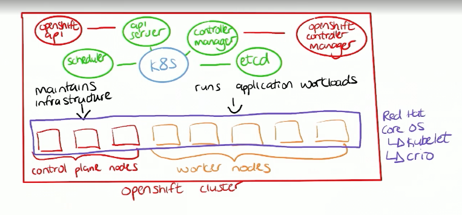
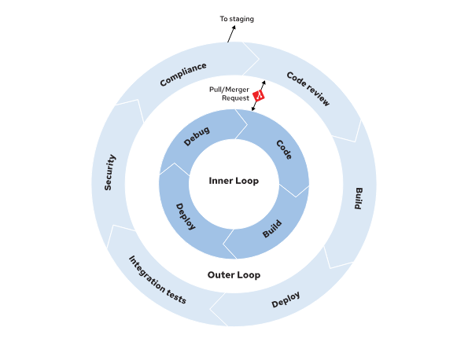
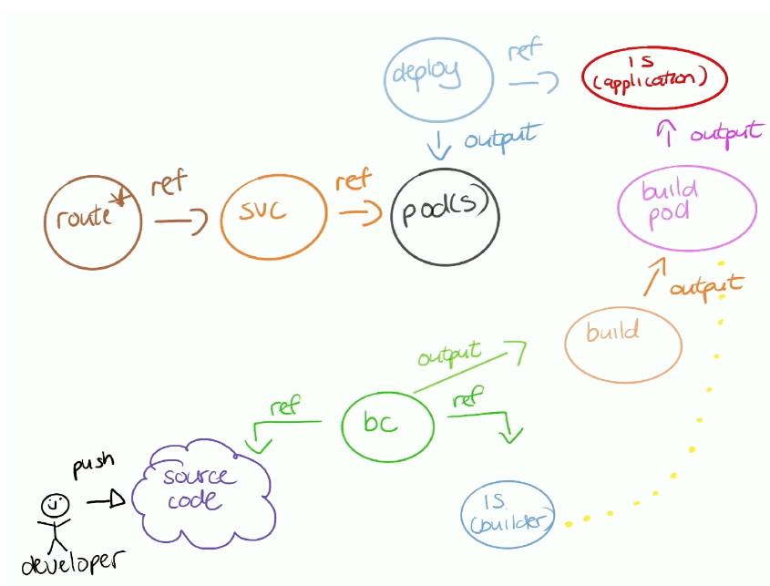

# 2025 DO 288 Red Hat OpenShift Developer II: Building and Deploying Cloud-native Applications
- [2025 DO 288 Red Hat OpenShift Developer II: Building and Deploying Cloud-native Applications](#2025-do-288-red-hat-openshift-developer-ii-building-and-deploying-cloud-native-applications)
  - [Setup](#setup)
- [DO288](#do288)
  - [Basics](#basics)
    - [Links](#links)
  - [Setup](#setup-1)
  - [Red Hat OpenShift Concepts and Terminology](#redhat-openshift-concepts-and-terminology)
  - [Deployments](#deployments)
    - [odo](#odo)
    - [devfile example](#devfile-example)
    - [Links](#links-1)
  - [Chapter 3.  Building and Publishing Container Images](#chapter3building-and-publishing-container-images)
      - [Links](#links-2)
    - [Using External Registries in Red Hat OpenShift](#using-external-registries-in-red-hat-openshift)
    - [Creating Image Streams](#creating-image-streams)
  - [Chapter 4.  Managing Red Hat OpenShift Builds](#chapter-4--managing-red-hat-openshift-builds)
      - [secrets \& config maps](#secrets--config-maps)
    - [Managing Application Builds](#managing-application-builds)
    - [Triggering Builds](#triggering-builds)
    - [Customizing an Existing S2I Base Image](#customizing-an-existing-s2i-base-image)
  - [Chapter 5.  Managing Red Hat OpenShift Deployments](#chapter-5--managing-red-hat-openshift-deployments)
      - [Links](#links-3)
    - [Managing Application Deployments](#managing-application-deployments)
      - [Secrets and Configuration Maps](#secrets-and-configuration-maps)
      - [Using Service Accounts](#using-service-accounts)
      - [Links](#links-4)
    - [Deploying Stateful Applications](#deploying-stateful-applications)
      - [Stateful Sets](#stateful-sets)
      - [Links](#links-5)
    - [Monitoring Application Health](#monitoring-application-health)
      - [Specifying Application Resource Requirements](#specifying-application-resource-requirements)
      - [Red Hat OpenShift Application Health Checks](#redhat-openshift-application-health-checks)
      - [Creating Probes by Using the CLI](#creating-probes-by-using-the-cli)
      - [Links](#links-6)
  - [Chapter 6.  Deploying Multi-container Applications](#chapter6deploying-multi-container-applications)
    - [Red Hat OpenShift Templates](#redhat-openshift-templates)
    - [Install Applications by Using Helm Charts](#install-applications-by-using-helm-charts)
      - [Links](#links-7)
    - [The Kustomize CLI](#the-kustomize-cli)
      - [Templating Deployments with Kustomize](#templating-deployments-with-kustomize)
      - [Links](#links-8)
    - [Red Hat OpenShift Pipelines Architecture and Components](#redhat-openshift-pipelines-architecture-and-components)
      - [Links](#links-9)
    - [Creating CI/CD Workflows by Using Red Hat OpenShift Pipelines](#creating-cicd-workflows-by-using-redhat-openshift-pipelines)
      - [Links](#links-10)

TOC created using the [yzhang.markdown-all-in-one VS Code extension](https://marketplace.visualstudio.com/items?itemName=yzhang.markdown-all-in-one)

## Setup

```sh
crc setup
crc start
crc delete
```

```sh
oc login -u developer -p developer https://api.ocp4.example.com:6443
oc whoami --show-console
```

# DO288

https://role.rhu.redhat.com/rol-rhu/app/courses/do288-4.14/
## Basics


etcd key value store
quay.io container registry
kubelet: on each cluster machine - ensure containers up & running
CRI-O: run, stop, restart containers implementing Kubernetes Container Runtime Interface (CRI)

### Links

* [Kubernetes Components](https://kubernetes.io/docs/concepts/overview/components/)
* [Understanding Kubernetes objects](https://kubernetes.io/docs/concepts/overview/working-with-objects/#kubernetes-objects)
* [Kubernetes Controllers](https://kubernetes.io/docs/concepts/architecture/controller/)
* [Kubernetes Custom Resources](https://kubernetes.io/docs/concepts/extend-kubernetes/api-extension/custom-resources/)
* [CRI-O](https://cri-o.io/)
* [Open Container Initiative](https://opencontainers.org/)

## Setup

OC 4.12

- https://console.redhat.com/openshift/create/local
- https://access.redhat.com/products/red-hat-openshift-container-platform
- https://odo.dev/


https://crc.dev/docs/introducing/
```sh
crc setup
crc start
crc delete
```

```sh
oc login -u developer -p developer https://api.ocp4.example.com:6443
oc whoami --show-console
```

## Red Hat OpenShift Concepts and Terminology

GitOps Operator

```sh
oc api-resources | less
oc explain pvc
oc get projects
oc get all -n openshift-authentication
```

## Deployments

```sh
oc new-app -i mysql \
	-e MYSQL_USER=user -e MYSQL_PASSWORD=pass \
	-e MYSQL_DATABASE=testdb -l db=mysql

oc new-app \
	--name hello -i php \ #use an image stream
	--code http://gitserver.example.com/mygitrepo.git

oc delete all --selector app=test

oc new-app \
	-o yaml registry.example.com/mycontainerimage

oc new-app -e DB_PASSWORD=test --name=todo-list \
	registry.ocp4.example.com:8443/redhattraining/openshift-dev-deploy-review-todo-list

oc delete all -l app=todo-list
```

### odo


```sh
odo create project ...
odo deploy

odo preference set ImageRegistry REGISTRY_URL/NAMESPACE

oc expose service SERVICE_NAME
```

### devfile example

```yaml
schemaVersion: 2.2.0
metadata:
  name: nodejs
  version: 2.1.1
  displayName: Node.js Runtime
  description: Stack with Node.js 16
  tags: ["Node.js", "Express", "ubi8"]
  projectType: "Node.js"
  language: "JavaScript"
  provider: Red Hat
  supportUrl: https://github.com/devfile-samples/devfile-support#support-information
parent:
  id: nodejs
  registryUrl: "https://registry.devfile.io"
components:
  - name: image-build
    image:
      imageName: nodejs-image:latest
      dockerfile:
        uri: Dockerfile
        buildContext: .
        rootRequired: false
  - name: kubernetes-deploy
    kubernetes:
      uri: deploy.yaml
commands:
  - id: build-image
    apply:
      component: image-build
  - id: deployk8s
    apply:
      component: kubernetes-deploy
  - id: deploy
    composite:
      commands:
        - build-image
        - deployk8s
      group:
        kind: deploy
        isDefault: true
```

### Links

- [odo Documentation](https://odo.dev/docs/introduction)
- [What is a devfile](https://devfile.io/docs/2.2.2/what-is-a-devfile)
- [Inner Loop with odo](https://odo.dev/docs/user-guides/quickstart)

## Chapter 3.  Building and Publishing Container Images

Use Red Hat Universal Base Images / UBI

find list here: https://catalog.redhat.com/search?searchType=containers

Support for non-root-users:

```Containerfile
USER root
RUN chgrp -R 0 /var/cache && \
    chmod -R g=u /var/cache
USER 1001
```

Graceful shutdown

```bash
#!/bin/env bash

function graceful_shutdown() {
  kill -SIGTERM "$java_pid"
  wait "$java_pid"
  exit 0
}

# Trap the SIGTERM signal
trap graceful_shutdown SIGTERM

_...script omitted..._

# Start the application
java -jar example.jar &
java_pid=$!

_...script omitted..._

# Wait for the process to finish
wait "$java_pid"
```

pre-stop hook

```yaml
apiVersion: v1
kind: Pod
metadata:
  name: example-pod
spec:
  containers:
    - name: my-container
      image: example.com/myimage
      lifecycle:
        preStop:
          httpGet:
            path: /shutdown
            port: 8080
```

maybe add labels with the `io.openshift` or `io.k8s` prefixes

```Containerfile
LABEL io.openshift.min-cpu 2
```

use / define
- working directories
- environment variables for stuff that might change, e.g. directories, version numbers etc.
- declared volumes
- exposed ports

#### Links

- [Red Hat Universal Base Images (UBI)](https://developers.redhat.com/products/rhel/ubi)
- [Universal Base Images FAQ](https://developers.redhat.com/articles/ubi-faq)
- [Red Hat Ecosystem Catalog - Certified container images](https://catalog.redhat.com/software/containers/search)
- [Container Lifecycle Hooks](https://kubernetes.io/docs/concepts/containers/container-lifecycle-hooks/)
- [Termination of Pods](https://kubernetes.io/docs/concepts/workloads/pods/pod-lifecycle/#pod-termination)

### Using External Registries in Red Hat OpenShift

3 Red Hat registries:
- registry.redhat.io (supported, requires authentication, browse with [catalog.redhat.com/software/containers/explore](https://catalog.redhat.com/software/containers/explore))
- registry.access.redhat.com (supported, browse with [catalog.redhat.com/software/containers/explore](https://catalog.redhat.com/software/containers/explore))
- [quay.io](https://quay.io)

Create image pull secret ...

```sh
oc create secret docker-registry SECRET_NAME \
	--docker-server REGISTRY_URL \
	--docker-username USER \
	--docker-password PASSWORD \
	--docker-email=EMAIL

# or

oc create secret generic SECRET_NAME \
	--from-file .dockerconfigjson=${XDG_RUNTIME_DIR}/containers/auth.json \
	--type kubernetes.io/dockerconfigjson
```

... and then use it in manifest ...

```yaml
spec:
  containers:
  - name: example-container
    image: REGISTRY_URL
  imagePullSecrets:
  - name: SECRET_NAME
```

... or link it to a service account

```sh
oc secrets link --for=pull default SECRET_NAME

# unlink:
oc secrets unlink default wrong-registry-credentials
```

side note on how to access event log:
```bash
oc get event --field-selector type=Warning --sort-by='.lastTimestamp'
```

### Creating Image Streams

```sh
oc describe is php -n openshift

# periodic updates, :tag is optional
oc import-image myimagestream --confirm --scheduled=true \
	--from example.com/example-repo/my-app-image:latest

# all tags
oc import-image myimagestream --confirm --all \
	--from registry/myorg/myimage

oc tag myimagestream:tag myimagestream:latest

oc create secret generic regtoken \
	--from-file .dockerconfigjson=${XDG_RUNTIME_DIR}/containers/auth.json \
	--type kubernetes.io/dockerconfigjson
oc import-image myimagestream --confirm \
	--from registry.example.com/myorg/myimage

oc get istag # oc get ImageStreamTag
```

use with kubernetes ressources

```sh
oc set image-lookup myimagestream
```

skopeo: Various operations with container images and container image registries

```sh
skopeo login registry.ocp4.example.com:8443 \
-u developer -p developer
skopeo inspect \
docker://registry.ocp4.example.com:8443/redhattraining/hello-world-nginx
```

## Chapter 4.  Managing Red Hat OpenShift Builds

build strategy
- [Source / Source-to-Image (S2I) build](https://docs.redhat.com/en/documentation/openshift_container_platform/3.11/html-single/developer_guide/index#source-to-image-strategy-options) (```sourceStrategy```)
- [Docker build](https://docs.redhat.com/en/documentation/openshift_container_platform/3.11/html-single/developer_guide/index#docker-strategy-options)  (```dockerStrategy```)
- [Custom build](https://docs.redhat.com/en/documentation/openshift_container_platform/3.11/html-single/developer_guide/index#custom-strategy-options) (```customStrategy```)
- [Pipeline build](https://docs.redhat.com/en/documentation/openshift_container_platform/3.11/html-single/developer_guide/index#pipeline-strategy-options) (```jenkinsPipelineStrategy```)

builder image is [automatically detected](https://docs.redhat.com/en/documentation/openshift_container_platform/3.11/html-single/developer_guide/index#specifying-source-code) for S2I builds and contains amongst others
- assemble script
- run script

The build input sources, in order of precedence are: `Dockerfile`, `Git`, `Image`, `Binary`, `Input Secrets`, and `External artifacts`.

build config (bc) - example for S2I builds
```yaml
kind: BuildConfig
apiVersion: build.openshift.io/v1
metadata:
  name: "php-sample-build"
spec:
  runPolicy: "Serial"
  triggers:
    - type: "ImageChange"
  source:
    git:
      uri: "http://services.lab.example.com/php-helloworld"
  strategy:
    sourceStrategy:
      from:
        kind: "ImageStreamTag"
        name: "ruby-20-centos7:latest"
  output:
    to:
      kind: "ImageStreamTag"
      name: "origin-ruby-sample:latest"
```



```sh
oc new-app -i php:7.3 --name=php-helloworld \
 --context-dir=php-helloworld https://github.com/RedHatTraining/DO288-apps
```

#### secrets & config maps

S2I build
```yaml
...
source:
  git:
    uri: "http://services.lab.example.com/java-helloworld"
  configMaps:
    - configMap:
        name: settings-mvn
      destinationDir: ".m2"
  secrets:
    - secret:
        name: secret-mvn
      destinationDir: ".ssh"
```

Docker strategy
```yaml
...
source:
  git:
    uri: "http://services.lab.example.com/java-helloworld"
  configMaps:
    - configMap: 1
        name: settings-mvn
      destinationDir: ".m2"
  secrets:
    - secret: 2
        name: secret-mvn
      destinationDir: ".ssh"
```

you can include custom assemble & run scripts for s2i

### Managing Application Builds

```sh
oc new-app --name java-application \
	--build-env BUILD_ENV=BUILD_VALUE \
	--env RUNTIME_ENV=RUNTIME_VALUE \
	-i redhat-openjdk18-openshift:1.8 \
	--context-dir java-application \
	https://git.example.com/example/java-application-repository

oc new-app --name java-application \
	--strategy Docker \
	--context-dir java-application \
	https://git.example.com/example/java-application-repository
```

```sh
oc get builds

oc start-build buildconfig/app
oc start-build --follow vertx-site

oc cancel-build buildconfig/app
oc cancel-build app-build-3

oc wait --for=condition=complete \
	--timeout=600s builds/vertx-site-2
```

```sh
oc set env buildconfig/app BUILD_LOGLEVEL="3"

oc logs -f build/app-1
oc logs -f buildconfig/app

oc debug deploy/app
```

### Triggering Builds

```sh
oc set triggers bc/name --from-image=project/image:tag
oc set triggers bc/name --from-image=project/image:tag --remove

oc set trigger deployment/name

oc set triggers bc/name --from-gitlab

oc create secret generic gitlab \
	--from-literal=username=developer --from-literal=password=d3v3lop3r
oc new-app --name builds-triggers \
	--source-secret gitlab $IMAGE~$GIT_REPO

oc rsh svc/builds-triggers \
	cat /etc/redhat-release
```

### Customizing an Existing S2I Base Image

- `/usr/libexec/s2i/assemble`
- `/usr/libexec/s2i/run`
- `/usr/libexec/s2i/usage`

```sh
c new-app --name bonjour \
	--context-dir labs/builds-s2i/s2i-scripts \
	httpd:2.4-ubi9~https://git.ocp4.example.com/developer/DO288-apps
```

what exactly does the resulting app image look like? 
-> unfortunately, it also contains the assemble script:

```
sh-5.1$ ls -la ./usr/libexec/s2i/
total 12
drwxr-xr-x. 2 root root  46 Feb 29  2024 .
drwxr-xr-x. 1 root root 151 Feb 29  2024 ..
-rwxrwxr-x. 1 root root 449 Feb 29  2024 assemble
-rwxrwxr-x. 1 root root 108 Feb 29  2024 run
-rwxrwxr-x. 1 root root 533 Feb 29  2024 usage
```

does it also contain the build artifacts? -> Perplexity Ai says usually not for compiled languages, but for interpreted languages it can be the case as the build container might be reused as app image. See https://www.perplexity.ai/search/does-an-application-image-buil-9BUxs_GdStyccN_Cy7jESg

## Chapter 5.  Managing Red Hat OpenShift Deployments

Deployment YAML
```yaml
apiVersion: apps/v1
kind: Deployment
metadata:
  name: hello-openshift
spec:
  selector:
    matchLabels:
      app: hello-openshift
  replicas: 3
  strategy:
    type: RollingUpdate
    rollingUpdate:
      maxSurge: 1
      maxUnavailable: 1
  template:
    ...output omitted...
```

DeploymentConfig is deprecated: https://access.redhat.com/articles/7041372

Deployment Strategies with Deployment Resources:
- Rolling
- Recreate
- Custom (-> custom container image for deployment behaviour)

Deployment Strategies with the Red Hat OpenShift Router:
- Blue-Green Deployment
- A/B Deployment

```sh
oc new-app --as-deployment-config \
	--name users-db \
	-e MYSQL_USER=developer -e MYSQL_PASSWORD=redhat -e MYSQL_DATABASE=users \
	https://git.ocp4.example.com/developer/DO288-apps \
	--context-dir=apps/deployments-strategy/users-db \
	-o yaml > application.yaml
oc apply -f application.yaml

oc rollout latest dc/users-db
```
#### Links

- [https://access.redhat.com/documentation/en-us/openshift_container_platform/4.14/html-single/building_applications/index#route-based-deployment-strategies](https://access.redhat.com/documentation/en-us/openshift_container_platform/4.14/html-single/building_applications/index#route-based-deployment-strategies)
- [An introduction to Blue-Green, canary, and rolling deployments](https://opensource.com/article/17/5/colorful-deployments)

### Managing Application Deployments

```sh
oc rollout status deployment example-deployment
oc rollout undo deployment example-deployment
oc rollout pause deployment example-deployment
oc rollout resume deployment example-deployment
oc scale deployment example-deployment --replicas=3
```

#### Secrets and Configuration Maps

Secret Types:
- `service-account-token`
- `basic-auth`
- `ssh-auth`
- `dockercfg`
- `tls`
- `opaque`

```sh
oc create configmap example-cm \
	--from-literal key1=value1 \
	--from-literal key2=value2

oc create configmap example-cm \
	--from-file=redis.conf

oc create configmap example-cm \
	--from-file=primary=/etc/redis/redis.conf \
	--from-file=replica=replica-redis.conf

oc get secret mysecret -o yaml

oc edit configmap my-cm

oc patch configmap/my-cm \
	--patch '{"data":{"key1":"newvalue1"}}'

oc extract secret/my-secret --to=/tmp/secret

oc extract secret/postgresql --to=.
tail -n +1 database*; echo

oc set data secret/my-secret --from-file=/tmp/secret

oc set env deployment my-deployment \
	--from configmap/my-cm
	
oc set volume deployment my-deployment --add \
	-t secret -m /path/to/mount/volume \
	--name myvol --secret-name my-secret
```

#### Using Service Accounts

Service accounts provide identity for applications.

```sh
oc create serviceaccount my-sa
oc set serviceaccount \
	deployment nginx-deployment my-sa

# mounted in pods:
oc exec somepod -- \
	ls /var/run/secrets/kubernetes.io/serviceaccount
```

configure security context

```yaml
apiVersion: apps/v1
kind: Deployment
metadata:
  name: example-deployment
spec:
  replicas: 1
  selector:
    matchLabels:
      app: example
  strategy: {}
  template:
    metadata:
      labels:
        app: example
    spec:
      containers:
      - command:
        - sleep
        - infinity
        image: registry.access.redhat.com/ubi8/ubi:8.0
        name: ubi
        securityContext:
          runAsNonRoot: true
          allowPrivilegeEscalation: false
          seccompProfile:
            type: RuntimeDefault
          capabilities:
            drop:
            - ALL
```

#### Links

- [Secrets](https://kubernetes.io/docs/concepts/configuration/secret/)
- [Sealed Secrets](https://github.com/bitnami-labs/sealed-secrets)
- [ConfigMaps](https://kubernetes.io/docs/concepts/configuration/configmap/)
- [Configure a Pod to Use a ConfigMap](https://kubernetes.io/docs/tasks/configure-pod-container/configure-pod-configmap/)
- [Security Contexts](https://github.com/kubernetes/kubernetes/blob/release-1.2/docs/design/security_context.md)
- [Configure a Security Context for a Pod or Container](https://kubernetes.io/docs/tasks/configure-pod-container/security-context/)
- [Pod Security Admission](https://kubernetes.io/docs/concepts/security/pod-security-admission/)

### Deploying Stateful Applications

Storage class
- cluster resource (setup by admin)
- associated with storage provider

Persistent volume 
- cluster resource (setup by admin)
- points to "real" volume

```yaml
apiVersion: v1
kind: PersistentVolume
metadata:
  name: data-volume
spec:
  capacity:
    storage: 5Gi
  volumeMode: Filesystem
  accessModes:
    - ReadWriteOnce
  persistentVolumeReclaimPolicy: Recycle
  storageClassName: fast
  nfs:
    path: /exports-ocp4/example
    server: 192.168.50.10
```

Persistent Volumen Claim (PVC)
- parameters
	- storage class (default if not specified)
	- size (integer + unit e.g. Gi)
	- accessModes
		- RWO
		- RWX
		- ROX
- point to persistent volume (mounted in fs)

```yaml
apiVersion: v1
kind: PersistentVolumeClaim
metadata:
  name: postgres-pvc
spec:
  storageClassName: nfs-storage
  accessModes:
  - ReadWriteOnce
  resources:
    requests:
      storage: 1Gi
  volumeMode: Filesystem
```

Mount PVC in pod

```yaml
apiVersion: v1
kind: Pod
metadata:
  name: app-pod
spec:
  containers:
    - name: app-ui
      image: quay.io/example/nginx
      volumeMounts:
      - mountPath: "/var/www/html"
        name: ui-volume
  volumes:
    - name: ui-volume
      persistentVolumeClaim:
        claimName: data-volume-claim
```

Adding Storage to Deployments
- one PVC for all instances!

```shell
oc set volumes dc/postgresql \
	--add \
	--name nfs-volume-storage \
	--type pvc \
	--claim-mode rwo \
	--claim-size 1Gi \
	--mount-path /var/lib/pgsql/data \
	--claim-name postgres-pvc \
	--overwrite
```

```yaml
apiVersion: apps/v1
kind: Deployment
metadata:
  name: my-deployment
  ...output omitted...
spec:
  ...output omitted...
  template:
    ...output omitted...
    spec:
      containers:
      - image: registry.ocp4.example.com:8443/rhel8/mysql-80
        ports:
        - containerPort: 3306
          protocol: TCP
        ...output omitted...
        volumeMounts:
        - mountPath: /tmp/data
          name: nfs-volume-storage
      ...output omitted...
      volumes:
      - name: nfs-volume-storage
        persistentVolumeClaim:
          claimName: my-data-claim
...output omitted...
```

#### Stateful Sets

- for stateful applications
- guaranteed to have a predictable ID for each pod
- dedicated PVC for each POD
	- scaling up will create new empty PVCs, i.e. no contents are copied
- separate network name for each replica

```yaml
apiVersion: apps/v1
kind: StatefulSet
metadata:
  name: my-stateful-app
spec:
  ...output omitted...
  replicas: 3
  serviceName: my-stateful-app
  template:
    ...output omitted...
    spec:
      containers:
        - image: my-app-image:latest
          name: mysql-80
          ports:
            - containerPort: 80
              protocol: TCP
          volumeMounts:
            - name: app-pvc
              mountPath: /var/lib/mysql
              subPath: mysql-db
      volumes:
        - name: init-db-volume
          configMap:
            name: init-db-cm
  volumeClaimTemplates:
    - metadata:
        name: app-pvc
      spec:
        accessModes: [ "ReadWriteOnce" ]
        storageClassName: nfs-storage
        resources:
          requests:
            storage: 1Gi
```

#### Links

- [Persistent Volumes Kubernetes Documentation](https://kubernetes.io/docs/concepts/storage/persistent-volumes/)
- [Ephemeral Volumes](https://kubernetes.io/docs/concepts/storage/ephemeral-volumes/)
- [Stateful Sets](https://kubernetes.io/docs/concepts/workloads/controllers/statefulset/)
- [Dynamic Provisioning](https://kubernetes.io/docs/concepts/storage/dynamic-provisioning/)

### Monitoring Application Health

#### Specifying Application Resource Requirements

```yaml
apiVersion: apps/v1
kind: Deployment
metadata:
  name: example-deployment
spec:
  replicas: 1
  selector:
    matchLabels:
      deployment: example-deployment
  template:
    metadata:
      labels:
        deployment: example-deployment
    spec:
      containers:
      - image: quay.io/example/deployment:1.0
        name: example-deployment
        resources:
          requests:
            cpu: 100m
            memory: 200Mi
          limits:
            memory: 200Mi
```

Eviction strategy

| Category    | Description                                                                         | OpenShift Eviction Strategy                            |
| :---------- | :---------------------------------------------------------------------------------- | :----------------------------------------------------- |
| Best-Effort | Pods without requests and limits, which have an unpredictable resource consumption. | First pods to evict.                                   |
| Burstable   | Pods with requests, and no limits or limits that exceed the requests.               | Pods to evict if there are no `Best-effort` pods left. |
| Guaranteed  | Pods with equal requests and limits.                                                | Never evicted.                                         |

```sh
oc describe limitranges

oc get events \
	--sort-by=metadata.creationTimestamp --field-selector type=Warning
```

#### Red Hat OpenShift Application Health Checks

Probes
- startupProbe
	- other probes not executed until successful
	- restart on failure
- readinessProbe
	- no more traffic if failing
- livenessProbe
	- restart on failure

| Name                  | Mandatory | Description                                                                                                                  | Default Value |
| :-------------------- | :-------- | :--------------------------------------------------------------------------------------------------------------------------- | :------------ |
| `initialDelaySeconds` | Yes       | Determines how long to wait after the container starts before beginning the probe.                                           | 0             |
| `timeoutSeconds`      | Yes       | Determines how long to wait for the probe to finish. If this time is exceeded, then OpenShift assumes that the probe failed. | 1             |
| `periodSeconds`       | No        | Specifies the frequency of the checks.                                                                                       | 1             |
| `successThreshold`    | No        | Specifies the minimum consecutive successes for the probe to be considered successful after it has failed.                   | 1             |
| `failureThreshold`    | No        | Specifies the minimum consecutive failures for the probe to be considered failed after it has succeeded.                     | 3             |

```yaml
readinessProbe:
  httpGet:
    path: /health
    port: 8080
  initialDelaySeconds: 15
  timeoutSeconds: 1
```

```yaml
livenessProbe:
  exec:
    command:
    - cat
    - /tmp/health
  initialDelaySeconds: 15
  timeoutSeconds: 1
```

```yaml
livenessProbe:
  tcpSocket:
    port: 8080
  initialDelaySeconds: 15
  timeoutSeconds: 1
```

#### Creating Probes by Using the CLI

```sh
oc set probe deployment/myapp --readiness \
	--get-url=http://:8080/readyz --period-seconds=20

oc set probe deployment/myapp --liveness \
	--open-tcp=3306 --period-seconds=20 \
	--timeout-seconds=1
```

#### Links

- [Kubernetes best practices: Resource requests and limits](https://cloud.google.com/blog/products/containers-kubernetes/kubernetes-best-practices-resource-requests-and-limits)
- [What everyone should know about Kubernetes memory limits, OOMKilled pods, and pizza parties](https://home.robusta.dev/blog/kubernetes-memory-limit)


## Chapter 6.  Deploying Multi-container Applications

### Red Hat OpenShift Templates

Access with `${MYPARAMETER}`
```yaml
- description: Myapp configuration data
  name: MYPARAMETER
  required: true
```

default
```yaml
parameters:
- description: Myapp configuration data
  name: MYPARAMETER
  value: /etc/myapp/config.ini
```

generate default
```yaml
parameters:
- description: ACME cloud provider API key
  name: APIKEY
  generate: expression
  from:"[a-zA-Z0-9]{12}"
```

```sh
oc new-app --file mytemplate.yaml -p PARAM1=value1 \
	-p PARAM2=value2
	
oc process -f mytemplate.yaml -p PARAM1=value1 \
	-p PARAM2=value2 > myresourcelist.json
oc create -f myresourcelist.json

oc process -f mytemplate.yaml -p PARAM1=value1 \
	-p PARAM2=value2 | oc create -f -

oc process -f mytemplate.yaml --parameters
```

can not be used as key for a label

### Install Applications by Using Helm Charts

```sh
helm repo add openshift-helm-charts \
	https://charts.openshift.io/
	
helm search repo openshift-helm-charts

helm pull openshift-helm-charts/redhat-quarkus
helm pull openshift-helm-charts/redhat-quarkus \
	--untar --destination redhat-quarkus

helm package my-chart-directory

helm push example-chart-0.1.0.tgz example.repository.org

helm install my-quarkus-application \
	openshift-helm-charts/redhat-quarkus \
	--set replicaCount=3,image.tag=latest

helm install --wait expense-service .

helm upgrade my-quarkus-application \
	openshift-helm-charts/redhat-quarkus

helm ls

helm history my-quarkus-application

helm rollback my-quarkus-application 1

helm uninstall my-quarkus-application

helm create my-helm-chart
```

templating language

```
apiVersion: apps/v1
kind: Deployment
metadata:
  name: example-deployment
spec:
  replicas: {{ .Values.replicaCount }}
...deployment omitted...
```

variable scope
```
{{ with .Values.image }}
...
      - image: {{ .repository | quote }}
        imagePullPolicy: {{ .pullPolicy | default "Always" | quote }}
        name: example-deployment
{{ end }}

```

control flow
```
      containers:
      - image: {{ .Values.image.repository | quote }}
      - {{ if eq .Values.createSharedSecret "true" }}
        env:
          - name: DATABASE_NAME
            valueFrom:
              secretKeyRef:
                key: database-name
                name: postgresql
...
        {{ end }}
```

example
```
...file omitted...
  database-user: {{ randAlphaNum 20 | b64enc }}
  {{end}}
  {{ if .Values.postgres.pass }}
  database-password: {{ .Values.postgres.pass | b64enc }}
  {{else}}
  database-password: {{ randAlphaNum 20 | b64enc }}
  {{end}}
```

Template rendering - works as well for remote charts
```sh
# render all templates
helm template .

# render specific template
helm template -s templates/serviceaccount.yaml .

helm template \
	--skip-tests ./ > ../kustomized-quotes/base/app.yaml
```

Use `templates/NOTES.txt`for message displayed after using the chart
#### Links

- [Using Helm with Red Hat OpenShift](https://www.redhat.com/en/technologies/cloud-computing/openshift/helm)
- [IBM Helm Repositories](https://github.com/IBM/charts)
- [Upstream Helm Repositories](https://github.com/helm/charts/)
- [HashiCorp Helm Repositories](https://helm.releases.hashicorp.com/)
- [Bitnami Helm repositories](https://github.com/bitnami/charts)
- [Ask the Product Manager Office Hours: Operators and Helm](https://www.youtube.com/watch?v=YowBHOOZakk)
- [Helm | Getting Started](https://helm.sh/docs/chart_template_guide/getting_started/)
- [Go Template Language](https://pkg.go.dev/text/template)

### The Kustomize CLI

#### Templating Deployments with Kustomize

example layout
```
myapp
├── base
└── overlays
  ├── production
  └── staging
```

`kustomization.yaml` file for each configuration set

```yaml
resources:
- deployment.yaml
- secrets.yaml
- service.yaml
```

overlay example
```yaml
resources:
- ../../base
patches:
- path: replica_limits.yaml
```


```sh
oc kustomize ./base
oc apply -k overlays/stage
```

#### Links

- [Kustomize - Kubernetes native configuration management](https://kustomize.io/)
- [Kubernetes Object Management](https://kubernetes.io/docs/concepts/overview/working-with-objects/object-management/)
- [Kustomize Examples](https://github.com/kubernetes-sigs/kustomize/tree/release-kustomize-v5.0/examples)
- [Kustomize Builtin Transformers](https://kubectl.docs.kubernetes.io/references/kustomize/builtins/)

### Red Hat OpenShift Pipelines Architecture and Components

The foundation of OpenShift Pipelines is _Tekton_
To enable the CI/CD capabilities in OpenShift, install the Red Hat OpenShift Pipelines operator from the Operator Hub.

- Pipeline
	- task
		- step
- Workspace: storage
	- e.g. share state between steps / tasks
* triggers
	- Trigger
	- TriggerBinding
	- TriggerTemplate

Reusable tasks available at [https://hub.tekton.dev/](https://hub.tekton.dev/)

tkn CLI - tekton
#### Links

- [Tekton Concept Model](https://tekton.dev/docs/concepts/concept-model/)
- [Tekton CLI](https://tekton.dev/docs/cli/)

### Creating CI/CD Workflows by Using Red Hat OpenShift Pipelines

Custom tasks (namespace/project scope)

```yaml
---
apiVersion: tekton.dev/v1
kind: Task
metadata:
  name: fetch-url
spec:
  results:
    - name: output
  params:
    - name: URL
      description: The URL to fetch.
      type: string
  steps:
    - name: curl-run
      image: example.com/example/image:latest
      script: |
        curl $(params.URL) | tee $(results.output.path)
```

Cluster tasks
- cluster scope
- now deprecated, replaced by resolvers

```yaml
---
apiVersion: tekton.dev/v1
kind: TaskRun
metadata:
  name: fetch-app
spec:
  taskRef:
    kind: ClusterTask
    name: git-clone
  params:
    - name: url
      value: https://git.example.com/app
    - name: revision
      value: main
    - name: subdirectory
      value: ""
```

Pipeline definition

```yaml
---
apiVersion: tekton.dev/v1
kind: Pipeline
metadata:
  name: my-pipeline
spec:
  params:
    - name: GIT_REPO
      type: string
      default: "example.com/app/repo"
  workspaces:
    - name: app-build

  tasks:
    - name: fetch-repository
      taskRef:
        name: git-clone
        kind: ClusterTask
      params:
        - name: url
          value: $(params.GIT_REPO)
      workspaces:
        - name: output
          workspace: app-build

    - name: run-lint
      taskRef:
        name: linter
        kind: Task
      params:
        - name: DIRECTORY
          value: "path/to/code"
      workspaces:
        - name: source
          workspace: app-build
      runAfter:
        - fetch-repository
```

PipelineRun
```yaml
---
apiVersion: tekton.dev/v1
kind: PipelineRun
metadata:
  name: fetch-pipeline
spec:
  pipelineRef:
    name: my-pipeline
  params:
    - name: GIT_REPO
      value: https://example.com/app/repo
```

Tekton
```sh
# Task
tkn t list
tkn t describe fetch-url
tkn t start fetch-url

# ClusterTask (deprecated)
tkn ct list
tkn ct describe openshift-client

# Pipeline
tkn p describe my-pipeline
tkn p start my-pipeline
tkn p start my-pipeline \
	-w name=app-build,volumeClaimTemplateFile=pvc-template.yaml

# Pipeline Run
tkn pr list
tkn pr logs my-pipeline-1
```

#### Links

- [Tekton Tasks](https://tekton.dev/docs/pipelines/tasks/
- [Tekton Pipelines](https://tekton.dev/docs/pipelines/pipelines/)
- [Tekton Task versus ClusterTask](https://tekton.dev/docs/pipelines/tasks/#task-vs-clustertask)
- [Getting Started with Tekton Resolvers](https://tekton.dev/docs/pipelines/resolution-getting-started/)
- [Variable Substitutions Supported by Tasks and Pipelines](https://tekton.dev/docs/pipelines/variables/)