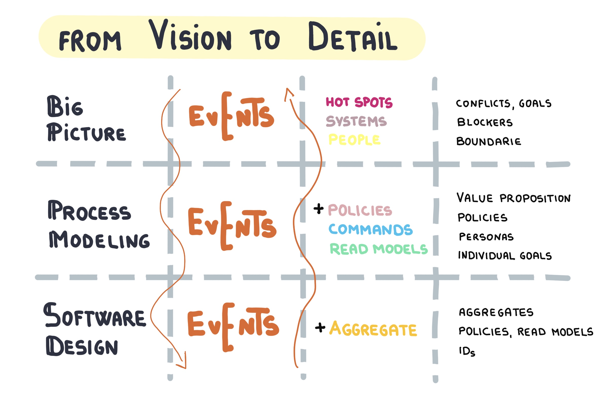

# TL500 DevOps Culture and Practices

- [TL500 DevOps Culture and Practices](#tl500-devops-culture-and-practices)
	- [Links](#links)
	- [Key Takeaways](#key-takeaways)
		- [Presentation / Teaching Learnings](#presentation--teaching-learnings)
		- [Interesting Concepts](#interesting-concepts)
	- [Details](#details)
		- [Event Storming](#event-storming)
		- [Metrics Based Process Mapping](#metrics-based-process-mapping)

TOC created using the [yzhang.markdown-all-in-one VS Code extension](https://marketplace.visualstudio.com/items?itemName=yzhang.markdown-all-in-one)

## Links

- [https://rht-labs.com/tech-exercise/slides/](https://rht-labs.com/tech-exercise/slides/)
- [https://rht-labs.com/tech-exercise/#/1-the-manual-menace/README](https://rht-labs.com/tech-exercise/#/1-the-manual-menace/README)
- [https://github.com/rht-labs/tech-exercise](https://github.com/rht-labs/tech-exercise)
## Key Takeaways

- [Visualization of work](https://openpracticelibrary.com/practice/visualisation-of-work/) is super useful
	- [Information radiators](https://rht-labs.com/tech-exercise/slides/content/?name=kick-off#/information-radiators) vs
	- Information refrigerators
	- Many practices of the [Open Practice Library](https://openpracticelibrary.com/) do this, especially (but not limited to)
		- [The Big Picture](https://openpracticelibrary.com/practice/the-big-picture/)
		- [Target Outcomes](https://openpracticelibrary.com/practice/target-outcomes/)
		- [Burndown Chart](https://openpracticelibrary.com/practice/burndown/) / [Burnup Chart](https://openpracticelibrary.com/practice/burnup-chart/)
			- analogy: landing aircraft carrier
		- [Overview important Practices](https://rht-labs.com/tech-exercise/slides/content/?name=pet-battle-lightning-talk#/48)
	- [Why visualize work?](https://rht-labs.com/tech-exercise/slides/content/?name=kick-off#/10)
- The right setting is important
	- Expectations Management
		- collect expectations
			- e.g. hopes & fears
	- [Social Contract](https://openpracticelibrary.com/practice/social-contract/) / [TL500 Social Contracts](https://rht-labs.com/tech-exercise/slides/content/?name=social-contracts)
	- psychological safety
	- [Stop the World](https://openpracticelibrary.com/practice/stop-the-world-event/)
	- Backlog & [Backlog Refinement](https://openpracticelibrary.com/practice/backlog-refinement/)
	- [Parking Lot]( https://openpracticelibrary.com/practice/parking-lot-car-park/)
	- [DoD](https://openpracticelibrary.com/practice/definition-of-done/)
	- [DoR](https://openpracticelibrary.com/practice/definition-of-ready/)
	- [Team Identity](https://openpracticelibrary.com/practice/team-identity/)
	- Visualization of Work (see above)
	- Shared understanding is super important (see almost all else)
	- Clarity of Goals & Priorities (see below)
- Clarity of Goals & Priorities is mega important
	- [Smart Goals](https://openpracticelibrary.com/practice/smart-goals/)
	- [Target Outcomes](https://openpracticelibrary.com/practice/target-outcomes/)
	* [Impact Mapping](https://openpracticelibrary.com/practice/impact-mapping/)
		* Visualize how strategic goals link to the teams work
		* Book "Impact Mapping" by Gojko Adzic
		* [TL500 Impact Mapping](https://rht-labs.com/tech-exercise/slides/content?name=impact-mapping)
	- [Priority Sliders](https://openpracticelibrary.com/practice/priority-sliders/) / [TL500 Priority Slides](https://rht-labs.com/tech-exercise/slides/content?name=priority-sliders)
	- [$100 Prioritisation](https://openpracticelibrary.com/practice/100-prioritisation/)
	- [Impact & Effort Prioritization](https://openpracticelibrary.com/practice/impact-effort-prioritization-matrix/) / [Weighted Shortest Job First](https://openpracticelibrary.com/practice/weighted-shortest-job-first/)
- Understanding of requirements and processes is super important
	- [Event Storming](https://openpracticelibrary.com/practice/event-storming/) / [TL500 Event Storming](https://rht-labs.com/tech-exercise/slides/content?name=event-storming)
	- [Metrics Based Process Mapping](https://openpracticelibrary.com/practice/metrics-based-process-mapping/) / [TL500 Metrics Based Process Mapping](https://rht-labs.com/tech-exercise/slides/content/?name=metrics-based-process-mapping)
	- [Empathy Mapping](https://openpracticelibrary.com/practice/empathy-mapping/)
	- [Non-Functional Requirements Map](https://openpracticelibrary.com/practice/non-functional-requirements-map/) / [TL500 Non-Functional Requirements Map](https://rht-labs.com/tech-exercise/slides/content/?name=non-functional-map)
	- [User Story Mapping & Value Slicing](https://openpracticelibrary.com/practice/user-story-mapping/) / [TL500 User Story Mapping and Value Slicing](https://rht-labs.com/tech-exercise/slides/content/?name=user-story-mapping-and-value-slicing) 
		- tip: directed by [Target Outcomes](https://openpracticelibrary.com/practice/target-outcomes/)
		- Book: User Story Mapping by Jeff Patton et al.
	- [Example Mapping](https://openpracticelibrary.com/practice/example-mapping/)
	- [Minimal Viable Product (MVP)](https://openpracticelibrary.com/practice/minimum-viable-product-mvp/)
- Feedback is super important
	- [Team Sentiment](https://openpracticelibrary.com/practice/team-sentiment/)
	- Regular [Retrospectives](https://openpracticelibrary.com/practice/retrospectives/)
		- important: react on feedback!
	- [Realtime Retrospective](https://openpracticelibrary.com/practice/realtime-retrospective/)
	- [Mood Marbles](https://openpracticelibrary.com/practice/mood-marbles/)
- Sustainability & Resilience is important
	- [Pair Programming](https://openpracticelibrary.com/practice/pair-programming/)
	- [Mob Programming](https://openpracticelibrary.com/practice/mob-programming/) / [TL500 Pair and Mob Programming](https://rht-labs.com/tech-exercise/slides/content?name=pair-and-mob-programming)
	- [Confidence Voting](http://openpracticelibrary.com/practice/confidence-voting/)
	- [Everything-as-code](https://openpracticelibrary.com/practice/everything-as-code/)
	- Visualization / Transparency (see above)
- Lean is about optimizing the flow
	- [Metrics Based Process Mapping](https://openpracticelibrary.com/practice/metrics-based-process-mapping/)
	- [Kanban](https://openpracticelibrary.com/practice/kanban/) / [TL500 Kanban](https://rht-labs.com/tech-exercise/slides/content/?name=kanban)
		- [Kanban Picture](https://openpracticelibrary.com/practice/kanban-picture/)
- Agile is about optimizing feedback loops & adaptability
	- [Agile Manifesto](https://agilemanifesto.org/)
		- [4 Values](https://rht-labs.com/tech-exercise/slides/content/?name=agile-overview#/6)
		- [12 Principles](https://rht-labs.com/tech-exercise/slides/content/?name=agile-overview#/8)
	- [Metrics Based Process Mapping](https://openpracticelibrary.com/practice/metrics-based-process-mapping/)
	- [Scrum](https://openpracticelibrary.com/practice/scrum/) / [TL-500 Scrum](https://rht-labs.com/tech-exercise/slides/content/?name=scrum)
		- [3-5-3 Formation](https://rht-labs.com/tech-exercise/slides/content/?name=scrum#/8)
		- [Iteration (Sprint) Planning](https://openpracticelibrary.com/practice/iteration-planning/)
		- [Daily Standup](https://openpracticelibrary.com/practice/daily-standup/)
		- [Showcase / Sprint Review](https://openpracticelibrary.com/practice/showcase/)
		- [Retrospectives](https://openpracticelibrary.com/practice/retrospectives/) / [TL500 Retrospectives](https://rht-labs.com/tech-exercise/slides/content?name=retrospectives)
- General Collaboration Practices
	- [Affinity Mapping](https://openpracticelibrary.com/practice/affinity-mapping/)
	- [Confidence Voting](http://openpracticelibrary.com/practice/confidence-voting/)
	- [Dot Voting](https://openpracticelibrary.com/practice/dot-voting/)
	- [TL500 Estimation](https://rht-labs.com/tech-exercise/slides/content?name=estimation)
		- [Relative Sizing](https://openpracticelibrary.com/practice/relative-estimation/)
		- Planning Poker
		- T-Shirt Sizes

### Presentation / Teaching Learnings
 
- Plan recaps
	- done by the participants!
	- e.g. Practice Overview
- Icebreakers & "looseners" are super important
	- [Ice Breakers](https://openpracticelibrary.com/practice/ice-breakers/)
	- some examples:
		- agile faces
		- Sort by Birthday
		- motivating / funny / interesting videos
		- individual / pair / mob drawing (Steven Tyler)
 - Keep an eye on the mood!
	 - e.g. with feedback techniques from above, but also be mindful
 - Optimize communication for audience
	- Involve audience with questions (right amount!)
	- What questions will the audience most likely want to have answered?
	- Right level of explanation detail & special terms

### Interesting Concepts

- Dogfooding
- [Team Topologies](https://teramtopologies.com)
	- Cognitive Load
- DevOps
	- [DevOps Core Competencies](https://rht-labs.com/tech-exercise/slides/content/?name=what-is-devops#/11)
	- [The Three Ways of DevOps](https://rht-labs.com/tech-exercise/slides/content/?name=what-is-devops#/6)
		- The DevOps Handbook by Gene Kim, et. al.
			- create delivery system
			- amplify feedback loops
			- learn & experiment continuously
	- Practices: CI, CD^2
- [TL500 DDD](https://rht-labs.com/tech-exercise/slides/content/?name=automated-testing#/ddd)
- [TL500 Test Automation](https://rht-labs.com/tech-exercise/slides/content/?name=automated-testing)
	- [BDD](https://openpracticelibrary.com/practice/behavior-driven-development/) / [TL500 BDD](https://rht-labs.com/tech-exercise/slides/content/?name=automated-testing#/bdd)
	- [TDD](https://openpracticelibrary.com/practice/test-driven-development/) / [TL500 TDD](https://rht-labs.com/tech-exercise/slides/content/?name=automated-testing#/tdd)
		- Lego 
		- KISS / YAGNI
- [Emerging Architecture](https://rht-labs.com/tech-exercise/slides/content/?name=event-storming#/31)
- [TL500 UX](https://rht-labs.com/tech-exercise/slides/content/?name=ux)
	- [Empathy Mapping](https://openpracticelibrary.com/practice/empathy-mapping/)
	- [Blue Green Deployments](https://openpracticelibrary.com/practice/blue-green-deployments/)
	- [A/B Testing](https://openpracticelibrary.com/practice/split-testing-a-b-testing/)
	- [More practices ...](http://rht-labs.com/tech-exercise/slides/content/?name=ux#/21)

## Details

### Event Storming

- [Event Storming](https://openpracticelibrary.com/practice/event-storming/) / [TL500 Event Storming](https://rht-labs.com/tech-exercise/slides/content?name=event-storming)
- [Artifacts](https://rht-labs.com/tech-exercise/slides/content/?name=event-storming#/8)
	- Big Picture
	- Process Diagram
	- Aggregate Modeling
	- UI Modeling

- [Diagram Elements](https://rht-labs.com/tech-exercise/slides/content/?name=event-storming#/20)
	- Events
		- orange
		- $subject $verb (past tense)
		- source: system, time, consequence of another event
	- Commands
		- blue
		- action started by an actor
		- represents a decision
	- Actors
		- yellow
		- user of system
	- Read Model
		- green
		- information needed in order to make a decision (data)
	- Questions
		- purple
		- pain points, how / what / why, assumptions ...
	- External Systems
		- (also) purple (?)
		- 3rd party services, existing systems
	- Policies & Procedures
		- light purple (?)
		- keywords: always, immediatly, rules, ...
	- Aggregates
		- (also) yellow (?)
		- state machine
		- part of a system
		- e.g. service / bounded context / subdomain
		- usually a noun
	- Extras
		- happy / sad path
- [Tips for Success](https://rht-labs.com/tech-exercise/slides/content/?name=event-storming#/34)
	- don't loose yourself in discussion!
		- it's all about communication, not perfection

### Metrics Based Process Mapping

- [Metrics Based Process Mapping](https://openpracticelibrary.com/practice/metrics-based-process-mapping/) / [TL500 Metrics Based Process Mapping](https://rht-labs.com/tech-exercise/slides/content/?name=metrics-based-process-mapping)
- related to [Value Stream Mapping](https://openpracticelibrary.com/practice/vsm-and-mbpm/)
- Book: Accelerate (Nicole Forsgen et al.)
- [Recommended Metrics of Velocity](https://rht-labs.com/tech-exercise/slides/content/?name=metrics-based-process-mapping#/9)
	- Frequency of deployments
	- Lead time new features
	- Frequency of change failures
	- Mean-time-to-repair / MTTR
- [Flow Metrics](https://rht-labs.com/tech-exercise/slides/content/?name=metrics-based-process-mapping#/11)
	- Throughput
	- WIP
	- Cycle Time
	- Work Item Age
- [Activity Card](https://rht-labs.com/tech-exercise/slides/content/?name=metrics-based-process-mapping#/15/0/3)
	- Step Name
	- Number of people & Flow barriers
	- Percentage complete & accurate
	- Process Time (PT) & Lead Time (LT)
- [Define the Timeline Critical Path](https://rht-labs.com/tech-exercise/slides/content/?name=metrics-based-process-mapping#/17)
- it's good for presentation & convincing
	- [TL500 Example](https://rht-labs.com/tech-exercise/slides/content/?name=metrics-based-process-mapping#/27)
	- current way
	- new way
	- improvement
- [Facilitation Tips](https://rht-labs.com/tech-exercise/slides/content/?name=metrics-based-process-mapping#/29)