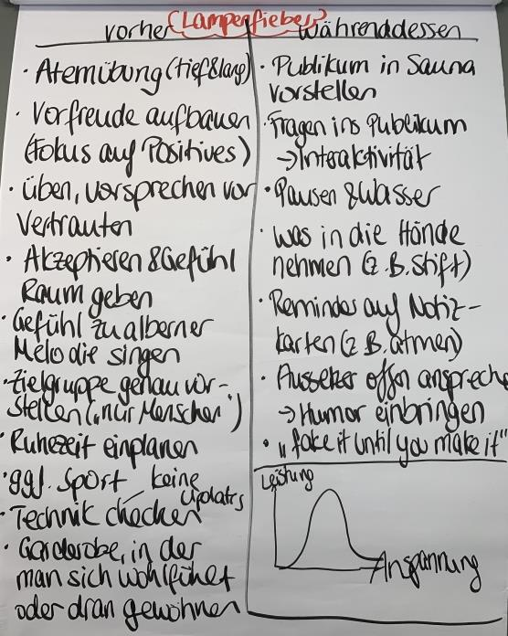

# Rhetorik Workshop

## Links

* [Handout](https://drive.google.com/file/d/16QAKLe9_2jhpupra3eWFX9Nw8yQb0khV/view?usp=sharing)
* [Fotoprotokoll](https://drive.google.com/file/d/1FlCJ0QtfMzrNMtWFyR3bdpToiUs9hfhu/view?usp=sharing)
* [Digital Campus](https://my.hr-future-tools.de/feedbackpeople/)

## Inhalt

* Aristoteles: Logos, Pathos, Ethos
* Wichtige Faktoren:
    * Legitimität
    * Authentizität
    * Logik
    * Präsenz
    * Relevanz (antizipierte Fragen beantworten)
    * Verständlichkeit
        * Einfachheit
           * Beispiele & Analogien / Bilder
            * Vorischt bei Abkürzungen
            * Wissensstand
        * Struktur
            * Agenda
            * gedankliche Cluster, explizite Strukuten
            * Roter Faden
        * Prägnanz
            * kurz & präzise (inkl Folien)
            * Fazit
        * Stimulanz
            * plastische Bilder, Grafiken, Videos
            * Geschichten
            * Fragen
            * lebhaftes Storytelling
* Fragestellungen:
    * Was möchte ich bewirken? (=> Legitimität!)
        * ggf Handlungsaufforderung
    * Zeit & Ressourcen?
    * Publikum?
    * 3-5 wichtigsten Publikumsfragen formulieren
        * + Antworten darauf
* Grundansätze / "Formlen"
    * [Pro- und Contra-Formel](https://drive.google.com/file/d/1gYioWsVtNKncwPcaF-944gFPTyn2xwx4/view?usp=sharing)
        * Interesse wecken
        * Problem definieren
        * Gegenposition darstellen
        * Entkräftung der Hauptargumente
        * Eigene Position formulieren
        * Begründen
        * Fazit
        * Handlungsaufforderung
    * [Standpunktformel](https://drive.google.com/file/d/1OygzTUf8izpUWaE4vN84x3SkW-mPSN-3/view?usp=sharing)
        * Interesse wecken
        * Worum geht es? / Standpunkt
        * Begründung
        * Fazit
        * Handlungsaufforderung
    * [Problemlösungs-Formel](https://drive.google.com/file/d/1LOQ9BxL8Cs-xft1DRGj4lTG_a3R7j5Su/view?usp=sharing)
        * Interesse wecken
        * Problem darstellen
        * Lösung / Ziel darstellen
        * Lösungsansätze aufzeigen / bewerten
        * Entscheidung für lösungsvariante
* Einstieg:  (und im talk Bezug nehmen)
    * (lustiges) Bild
    * Video
    * Gegenstand ins spiel bringen
    * News
    * Anekdote bzw Geschichte / Erlebnis
    * provoziernde Beauptung
    * Historisches / zukünftiges Ereignis
    * Versprechen (!?)
* Körpersprache & Stimme (Ab Folie 21)
* Verschiedene Menschentypen individuell überzeugen => ab Folie 57
* Argumentieren (Ab Folie 63)
    * Argumentieren Sie nach dem Köderprinzip – Sie starten mit einem „mittelstarken“ Argument und beginnen dann die aufsteigende Linie.
* Umgang mit Einwänden
    * ausreden lassen & zuhören
    * auf Wünsche / zweifel hinter Einwänden eingehen
    * Verständnis durch konkrete Nachfragen absichern
    * Eiwände in Argumentation berücksichtigen
    * gemeinsam für & wider abwägen
    * LIMO Technik (Lob, Interesse, Mängel zugeben, Offenheit für weitere Diskussion)
        * ggf. Diskussionsparkplatz oÄ
* Umgang mit Lampenfieber
    
    